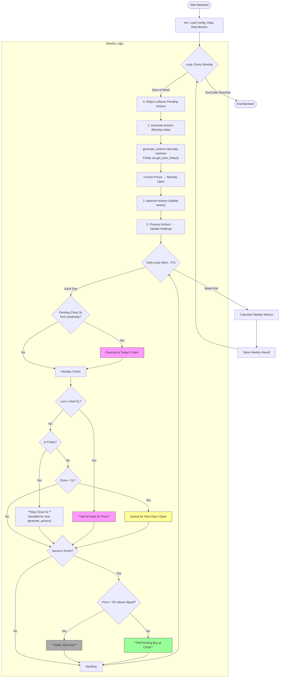
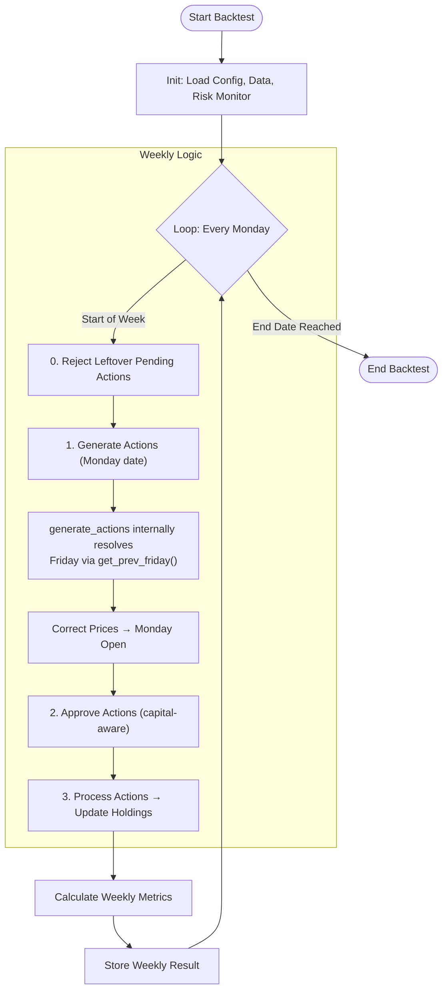

# Backtesting Flow (`runner.py`)

Two modes available via `check_daily_sl` parameter.

---

## Mode 1: Daily SL (`check_daily_sl=True`) — Recommended

Full intra-week stop-loss monitoring with mid-week vacancy fills.

---

## Mode 2: Weekly SL (`check_daily_sl=False`)

SL checks only at weekly rebalance via `generate_actions`. No intra-week monitoring.

---

## Key Design Decisions

| Aspect | Behaviour |
|--------|-----------|
| **Date Resolution** | Runner passes Monday; `generate_actions` internally calls `get_prev_friday()` for rankings, market data, indicators |
| **Hard SL** | `low ≤ SL × (1 − hard_sl_pct)` → sell at hard SL price (same day) |
| **Close SL (Mon-Thu)** | `close < SL` → sell at next day's open |
| **Friday Close SL** | Handled by `generate_actions` on next Monday (TradingEngine detects `fresh_sl ≥ close`) |
| **Mid-week Buy Fill** | Every day checks for vacancy; 3% stale guard prevents chasing rallied stocks |
| **Pending Rejection** | Unfilled pending buys rejected at start of next week |
| **Execution Prices** | Monday: corrected to open; Daily SL: hard SL at SL price, close SL at next open |
