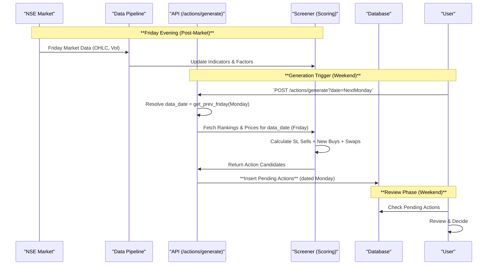

# Live Trading Flow — Action Generation Only

This diagram shows the **Friday Action Generation** workflow.
All subsequent steps (approve, execute, process) are performed
manually on the trading platform.

### Key Points

| Aspect | Detail |
|--------|--------|
| **Input** | `date=NextMonday` (e.g., `2025-01-13`) |
| **Data Resolution** | `get_prev_friday(Monday)` → Friday for rankings, market data, indicators |
| **Action Date** | Monday — actions are stamped for Monday execution |
| **SL Types** | **Close-based SL** (trailing, from Friday close) generates SELL actions; **Hard SL** (intraday) is monitored live by the trader |
| **After Generation** | Approve & execute manually on your trading platform Monday morning |
