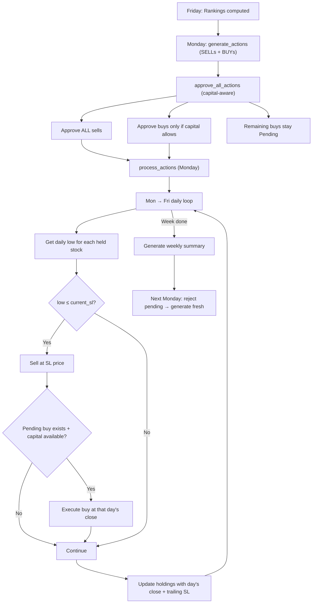

# Daily Stop-Loss Processing + Bug Fixes

## Overview

Change backtesting from weekly-only processing to daily stop-loss monitoring with capital-aware buy approval. Also fix 4 trading logic bugs from the audit.

## Proposed Flow



### Key Rules

| Item | Rule |
|------|------|
| **SL check** | Mon → Fri daily |
| **SL sell price** | SL price itself |
| **Buy execution price** | Close of the day it fills |
| **Unfilled buys** | Stay Pending until filled or rejected next Monday |
| **approve_all_actions** | Approve all sells; approve buys only if capital allows |
| **Holdings** | Updated daily (one row per stock per day) |
| **Summary** | Weekly (Friday) |

---

## Proposed Changes

---

### [MODIFY] [runner.py](file:///c:/Users/harsh/Documents/GitHub/stocks_screener_v2/src/backtesting/runner.py)

Major rewrite of `run()` and new `_process_daily_stoploss()` method:

```python
def run(self):
    for monday in mondays:
        ranking_friday = monday - timedelta(days=3)
        
        # 1. Generate actions from Friday rankings
        actions = self.actions_service.generate_actions(monday, skip_pending_check=True)
        
        # 2. Capital-aware approval (sells always, buys if budget allows)
        self.actions_service.approve_all_actions(monday)
        
        # 3. Process approved actions
        self.actions_service.process_actions(monday)
        
        # 4. Daily SL check Mon → Fri
        friday = monday + timedelta(days=4)
        self._process_daily_stoploss(monday, friday)
        
        # 5. Reject any still-pending buys
        self.actions_service.reject_pending_actions()
        
        # 6. Weekly summary (on Friday)
        ...
```

**`_process_daily_stoploss(monday, friday)`** — new method:

For each business day (Mon-Fri):
1. Get all current holdings from DB
2. For each holding, get that day's low
3. If `low <= current_sl` → create sell action at SL price, approve, process
4. After sells: check for Pending buy actions → if capital available, approve at that day's close, process
5. Update all remaining holdings: `current_price` = day's close, recalculate `current_sl`
6. Write updated holdings to DB

---

### [MODIFY] [actions_service.py](file:///c:/Users/harsh/Documents/GitHub/stocks_screener_v2/src/services/actions_service.py)

#### Change: `approve_all_actions` — capital-aware (L244-282)

Currently approves everything unconditionally. Change to:
- Always approve sell actions
- Track remaining capital (starting from current `remaining_capital`)
- For buy actions: only approve if `units * execution_price <= remaining_capital`
- If not enough capital: **skip** (leave as Pending)

```python
def approve_all_actions(self, action_date: date) -> int:
    actions_list = self.actions_repo.get_actions(action_date)
    
    # Get current capital
    summary = self.investment_repo.get_summary()
    remaining = float(summary.remaining_capital) if summary else self.config.initial_capital
    
    approved = 0
    
    # Approve sells first (always)
    for item in actions_list:
        if item.type == 'sell':
            execution_price = item.execution_price or marketdata.get_marketdata_first_day(item.symbol, action_date).open
            self.actions_repo.update_action({
                'action_id': item.action_id,
                'status': 'Approved',
                'execution_price': execution_price,
                ...costs...
            })
            remaining += item.units * execution_price  # freed capital
            approved += 1
    
    # Approve buys only if capital allows
    for item in actions_list:
        if item.type == 'buy':
            execution_price = marketdata.get_marketdata_by_trading_symbol(item.symbol, action_date).close
            cost = item.units * execution_price
            if cost <= remaining:
                self.actions_repo.update_action({
                    'action_id': item.action_id,
                    'status': 'Approved',
                    'execution_price': execution_price,
                    ...costs...
                })
                remaining -= cost
                approved += 1
            else:
                logger.info(f"Pending BUY {item.symbol}: insufficient capital ({cost:.0f} > {remaining:.0f})")
    
    return approved
```

> [!IMPORTANT]
> Buy execution price is now **close** (not open). For Monday this means Monday's close.

#### New method: `reject_pending_actions()`

```python
def reject_pending_actions(self) -> int:
    pending = self.actions_repo.get_pending_actions()
    for action in pending:
        self.actions_repo.update_action({
            'action_id': action.action_id,
            'status': 'Rejected'
        })
    return len(pending)
```

#### Bug 1 fix — `update_holding` (L369-370)
Use `rank_date` for `current_price` and `atr`:

```diff
+rank_date = action_date - timedelta(days=3)
-atr = indicators.get_indicator_by_tradingsymbol('atrr_14', symbol, action_date)
-current_price = marketdata.get_marketdata_by_trading_symbol(symbol, action_date).close
+atr = indicators.get_indicator_by_tradingsymbol('atrr_14', symbol, rank_date)
+current_price = marketdata.get_marketdata_by_trading_symbol(symbol, rank_date).close
```

#### Bug 2 fix — `buy_action` (L66)
Use `ranking_date` for ATR:

```diff
+ranking_date = action_date - timedelta(days=3)
-atr = indicators.get_indicator_by_tradingsymbol('atrr_14', symbol, action_date)
+atr = indicators.get_indicator_by_tradingsymbol('atrr_14', symbol, ranking_date)
```

#### Bug 4 fix — `generate_actions` (L183-196)
Compute fresh effective stop before SL trigger check:

```diff
 for h in current_holdings:
     low = self.fetch_low(h.symbol, ranking_date)
-    prices[h.symbol] = h.current_sl if low <= h.current_sl else low
+    # Compute fresh trailing stop with current Friday data
+    md = marketdata.get_marketdata_by_trading_symbol(h.symbol, ranking_date)
+    atr_val = indicators.get_indicator_by_tradingsymbol('atrr_14', h.symbol, ranking_date)
+    stops = calculate_effective_stop(
+        buy_price=float(h.entry_price), current_price=float(md.close),
+        current_atr=float(atr_val) if atr_val else 0,
+        initial_stop=float(h.entry_sl), stop_multiplier=self.config.sl_multiplier,
+        sl_step_percent=self.config.sl_step_percent,
+        previous_stop=float(h.current_sl)
+    )
+    fresh_sl = stops['effective_stop']
+    prices[h.symbol] = fresh_sl if low <= fresh_sl else low
```

---

### [MODIFY] [actions_repository.py](file:///c:/Users/harsh/Documents/GitHub/stocks_screener_v2/src/repositories/actions_repository.py)

#### New: `get_pending_actions()`
```python
def get_pending_actions(self):
    return self.session.query(ActionsModel).filter(
        ActionsModel.status == 'Pending'
    ).all()
```

#### New: `insert_action(action_dict)`
For mid-week individual action inserts without deleting existing actions:
```python
def insert_action(self, action_dict):
    try:
        action = ActionsModel(**action_dict)
        self.session.add(action)
        self.session.commit()
        return action
    except Exception as e:
        logger.error(f"Error insert_action: {e}")
        self.session.rollback()
        return None
```

---

### [MODIFY] [stoploss_utils.py](file:///c:/Users/harsh/Documents/GitHub/stocks_screener_v2/src/utils/stoploss_utils.py)

#### Bug 6 fix — trailing stop can decrease (L139)
```diff
-effective_stop = min(atr_stop, hard_stop)
+effective_stop = max(min(atr_stop, hard_stop), previous_stop)
```

---

## Verification Plan

1. Re-run 1-year backtest (2025-01-01 to 2026-02-09)
2. Verify via `debug_db.py`:
   - SL sells appear on actual trigger day (Mon-Fri), not just Mondays
   - Zero holdings where `current_price < current_sl`
   - `Rejected` status for unfilled buys
   - Holdings table has daily rows
   - Summary table has weekly rows
3. Compare final portfolio value with previous ₹200K run
