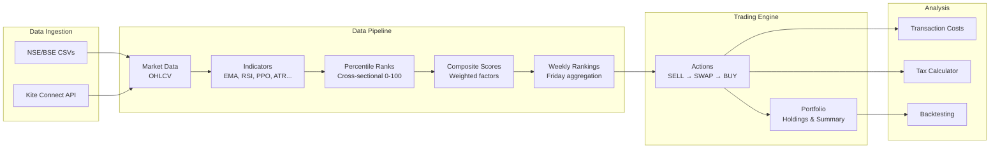

# Stock Screener V2

A multi-factor momentum screening and portfolio management system for Indian stocks (NSE/BSE). Built with Flask, SQLAlchemy, and Kite Connect API.

---

## ✨ Features

- **Multi-Factor Scoring** — Trend, Momentum, Risk Efficiency, Volume, Structure factors with configurable weights
- **Cross-Sectional Percentile Ranking** — Daily percentile ranks across the entire stock universe
- **Goldilocks Trend Scoring** — Non-linear distance-from-EMA200 scoring (sweet spot = 10–35%)
- **RSI Regime Mapping** — Non-linear RSI zones for momentum (sweet spot = 50–70)
- **Weekly Rankings** — Friday-based weekly score aggregation for consistent comparison
- **Champion vs Challenger Rotation** — Swap incumbents only when challengers beat by configurable buffer
- **Dual Stop-Loss System** — ATR trailing + Hard trailing (10% step) + Intraday hard SL (5%)
- **Multi-Phase Action Generation** — SELL → SWAP → BUY phases for systematic rebalancing
- **Indian Market Cost Model** — STT, stamp duty, GST, exchange fees, impact cost, DP charges
- **Tax-Aware Trading** — STCG/LTCG optimization with near-1-year hold bias
- **Portfolio Risk Controls** — Drawdown circuits, sector concentration limits, VIX scaling
- **Backtesting Engine** — Weekly/daily SL simulation with trade-level analytics
- **REST API** — Flask-Smorest with auto-generated Swagger/OpenAPI docs

---

## 🏗️ Architecture Overview



---

## 🚀 Quick Start

```bash
# 1. Clone
git clone <repo-url>
cd stocks_screener_v2

# 2. Install dependencies
poetry install

# 3. Configure secrets
cp local_secrets.example.py local_secrets.py
# Edit local_secrets.py with your Kite API credentials

# 4. Initialize database
make db-init

# 5. Run server
make run
# Server → http://127.0.0.1:5000
# Swagger UI → http://127.0.0.1:5000/swagger-ui
```

---

## 📚 Documentation

| Document | Description |
|----------|-------------|
| [Setup Guide](docs/SETUP.md) | Installation, configuration, troubleshooting |
| [Architecture](docs/ARCHITECTURE.md) | System design, data flow, database schema |
| [Day 0 Setup](docs/DAY0.md) | Initial stock universe loading from NSE/BSE |
| [Strategy Guide](docs/STRATEGY.md) | Indicators, scoring, trading logic, risk controls |
| [API Reference](docs/API.md) | All REST API endpoints (70+ routes) |
| [Backtesting](docs/BACKTESTING.md) | Backtest engine, modes, report interpretation |
| [TODO](docs/TODO.md) | Future work and enhancements |

---

## 🔧 Makefile Commands

| Command | Description |
|---------|-------------|
| `make install` | Install dependencies |
| `make run` | Start Flask server |
| `make dev` | Start with auto-reload |
| `make db-init` | Initialize DB migrations |
| `make db-migrate` | Create new migration |
| `make db-upgrade` | Apply pending migrations |
| `make db-reset` | Delete and recreate database |
| `make test` | Run tests with coverage |
| `make format` | Format code (black + isort) |
| `make lint` | Lint with flake8 |
| `make clean` | Remove cache files |
| `make setup` | Full setup (install + db init + migrate + upgrade) |

---

## 📁 Project Structure

```
stocks_screener_v2/
├── run.py                         # Application entry point
├── db.py                          # SQLAlchemy instance
├── Makefile                       # Dev commands
├── pyproject.toml                 # Poetry dependencies
├── local_secrets.py               # API credentials (gitignored)
├── data/                          # CSV files (NSE/BSE instrument lists)
├── src/
│   ├── config/                    # Configuration classes
│   │   ├── strategies_config.py   # Factor weights, costs, tax, sizing params
│   │   ├── indicators_config.py   # pandas_ta study definitions
│   │   ├── flask_config.py        # Flask/SQLAlchemy settings
│   │   ├── kite_config.py         # Kite Connect configuration
│   │   └── logger_config.py       # JSON logging setup
│   ├── api/v1/routes/             # REST API endpoints (14 blueprints)
│   ├── models/                    # SQLAlchemy models (10 tables)
│   ├── repositories/              # Data access layer (DB queries)
│   ├── schemas/                   # Marshmallow request/response schemas
│   ├── services/                  # Business logic layer
│   │   ├── init_service.py        # Day 0 initialization
│   │   ├── marketdata_service.py  # Kite OHLCV fetch
│   │   ├── indicators_service.py  # Technical indicator calculations
│   │   ├── percentile_service.py  # Cross-sectional percentile ranking
│   │   ├── factors_service.py     # Goldilocks/RSI factor scoring
│   │   ├── score_service.py       # Composite score generation
│   │   ├── ranking_service.py     # Weekly ranking aggregation
│   │   ├── actions_service.py     # SELL/SWAP/BUY action generation
│   │   ├── trading_service.py     # Trade execution logic
│   │   ├── investment_service.py  # Portfolio management
│   │   └── backtesting_service.py # Backtest Engine
│   ├── utils/                     # Helpers (sizing, stoploss, costs, tax)
│   └── adaptors/                  # External API adaptors (Kite)
├── templates/                     # HTML (dashboard, backtest, actions)
├── docs/                          # Documentation
└── migrations/                    # Alembic migrations
```

---

## 🌐 Web Dashboard

Access at `http://127.0.0.1:5000/` after starting the server.

| Page | URL | Features |
|------|-----|----------|
| Dashboard | `/` | Action buttons, investments table, top 20 rankings |
| Backtest | `/backtest` | Configure and run backtests, view results |
| Actions | `/actions` | View/filter trade actions by date |

---

## ⚙️ Tech Stack

| Component | Technology |
|-----------|-----------|
| Backend | Python 3.13, Flask, Flask-Smorest |
| ORM | SQLAlchemy + Flask-Migrate (Alembic) |
| Database | SQLite (main + backtest) |
| API Docs | Swagger UI (auto-generated) |
| Package Manager | Poetry |
| Market Data | Kite Connect API, yfinance |
| Technical Analysis | pandas_ta |

---

## 📄 License

MIT License — See LICENSE file.

---

**Disclaimer**: This tool is for educational purposes only. Not investment advice.
