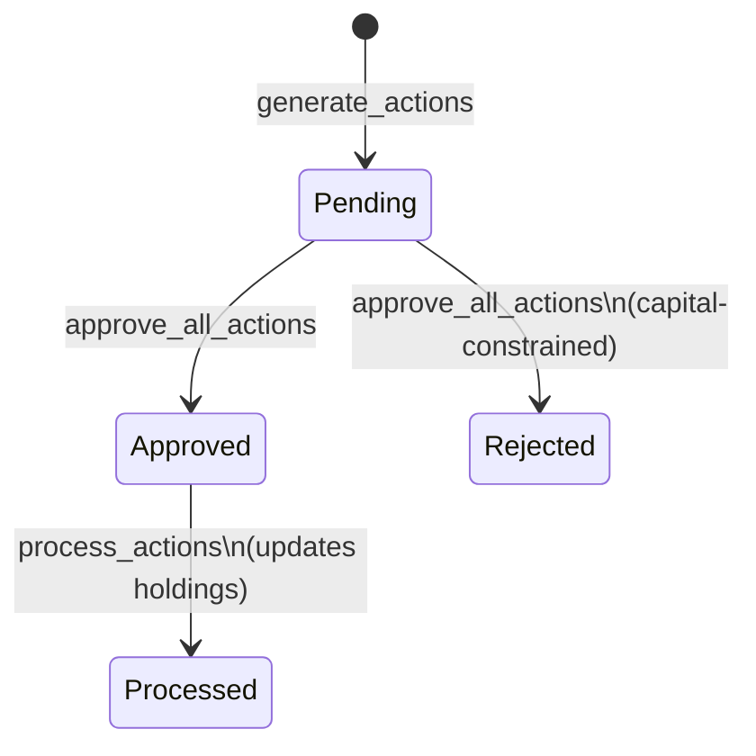

# API Reference

> **Last Updated:** 2026-05-03

Complete reference for the Stock Screener V2 REST API.

**Base URL**: `http://localhost:5000`
**Swagger UI**: [http://localhost:5000/api/v1/swagger-ui](http://localhost:5000/api/v1/swagger-ui)

All endpoints are prefixed with `/api/v1/`. Request bodies are JSON unless noted. Dates use `YYYY-MM-DD` format.

---

## 🚀 App Orchestration

System-wide pipeline operations and data maintenance.

### `POST /api/v1/app/run-pipeline`

Run the full data processing pipeline. Each step is optional — pass `false` to skip it.

| Step | Field | Description |
|------|-------|-------------|
| 1 | `init` | Initialize instruments from NSE/BSE CSVs |
| 2 | `marketdata` | Fetch latest OHLCV from Kite |
| 3 | `indicators` | Calculate technical indicators |
| 4 | `percentile` | Generate cross-sectional percentile ranks |
| 5 | `score` | Calculate composite scores |
| 6 | `ranking` | Generate weekly rankings |

### `DELETE /api/v1/app/cleanup`

Delete data after a specific date. Useful for resetting a bad pipeline run.

**Query params:** `start_date` (required), `marketdata`, `indicators`, `percentile`, `score`, `ranking` (all default `true`)

### `POST /api/v1/app/recalculate`

Force recalculation of Percentile → Score → Ranking from a specific date forward (skips market data re-fetch).

**Query params:** `start_date`

---

## 🛠️ Initialization

### `POST /api/v1/init/`

Run the Day 0 initialization process. Reads NSE/BSE CSVs from `data/`, fetches market cap from yfinance, filters the universe, and inserts into `instruments` and `master` tables.

> Requires `data/EQUITY_L.csv` and `data/bse_equity_t.csv` to be present. See [Day 0 Setup](DAY0.md).

---

## ⚙️ Configuration

### `GET /api/v1/config/{config_name}`

Retrieve current strategy configuration. The default config name is `momentum_config`.

### `PUT /api/v1/config/{config_name}`

Update strategy configuration at runtime. Only pass the fields you want to change.

### `POST /api/v1/config/{config_name}`

Create a new strategy configuration named `{config_name}`.

---

## 📈 Data API

### Instruments

| Method | Endpoint | Description |
|--------|----------|-------------|
| `GET` | `/api/v1/instruments` | List all instruments in the universe |
| `GET` | `/api/v1/instruments/{token}` | Get details for a specific instrument token |

### Market Data

| Method | Endpoint | Description |
|--------|----------|-------------|
| `GET` | `/api/v1/market_data/latest/{symbol}` | Get most recent OHLCV for a symbol |
| `POST` | `/api/v1/market_data/` | Bulk insert OHLCV records |
| `GET` | `/api/v1/market_data/query` | Query a date range (body: `symbol`, `start_date`, `end_date`) |

### Indicators

| Method | Endpoint | Description |
|--------|----------|-------------|
| `GET` | `/api/v1/indicators/latest/{symbol}` | Get latest calculated indicators |
| `POST` | `/api/v1/indicators/generate` | Run indicator calculation for a date |

### Percentiles

| Method | Endpoint | Description |
|--------|----------|-------------|
| `POST` | `/api/v1/percentile/update/{date}` | Generate cross-sectional percentile ranks for a date |
| `GET` | `/api/v1/percentile/query/{date}` | Get all stock percentiles for a date |

### Scores

| Method | Endpoint | Description |
|--------|----------|-------------|
| `POST` | `/api/v1/score/generate` | Generate composite scores for all pending dates |
| `GET` | `/api/v1/score/{symbol}?date=YYYY-MM-DD` | Get composite score for a specific stock and date |

### Rankings

| Method | Endpoint | Description |
|--------|----------|-------------|
| `POST` | `/api/v1/ranking/generate` | Generate Friday-anchored weekly rankings |
| `GET` | `/api/v1/ranking/top/{n}?date={date}` | Get top N stocks for a date |
| `GET` | `/api/v1/ranking/symbol/{symbol}?date={date}` | Get ranking position for a specific stock |

---

## ⚡ Trading Actions

### Action Lifecycle

### Endpoints

| Method | Endpoint | Description |
|--------|----------|-------------|
| `POST` | `/api/v1/actions/generate` | Generate SELL/SWAP/BUY recommendations |
| `GET` | `/api/v1/actions/` | List all pending actions |
| `POST` | `/api/v1/actions/approve` | Approve pending actions; sets execution price to next-day open |
| `POST` | `/api/v1/actions/process` | Process approved actions → update holdings and portfolio summary |

**`generate_actions` query params:**
- `date`: Date to generate actions for (defaults to today)
- `check_daily_sl`: If `true`, runs a close-based stop-loss check only (mid-week use)
- `mid_week_buy`: If `true`, advances pending buys to fill newly-opened slots

---

## 💼 Investments (Portfolio)

### Holdings & Summary

| Method | Endpoint | Description |
|--------|----------|-------------|
| `GET` | `/api/v1/investment/holdings` | Current portfolio holdings with stop-loss and unrealized P&L |
| `GET` | `/api/v1/investment/summary` | Portfolio summary: total value, cash, XIRR, gains |
| `GET` | `/api/v1/investment/summary-history` | Historical equity curve and drawdown series |
| `POST` | `/api/v1/investment/sync-prices` | Update holdings with latest market prices (does not add new data) |

### Capital Events

Capital events track all money flowing in and out of the portfolio. They are the source of truth for `total_capital` and `remaining_capital` calculations.

| Method | Endpoint | Description |
|--------|----------|-------------|
| `POST` | `/api/v1/investment/capital-events` | Add a capital infusion or withdrawal |
| `GET` | `/api/v1/investment/capital-events` | List all capital events |

**Capital event `event_type` values:** `initial` | `infusion` | `withdrawal` | `realized_gain`

### Trade Journal

| Method | Endpoint | Description |
|--------|----------|-------------|
| `GET` | `/api/v1/investment/trade-journal` | Complete trade history with FIFO-matched P&L |

The trade journal uses FIFO matching to pair each SELL with the earliest unmatched BUY for the same symbol. Returns: entry/exit date, price, units, P&L, return %, holding days, exit reason.

### Manual Trades

| Method | Endpoint | Description |
|--------|----------|-------------|
| `POST` | `/api/v1/investment/manual/buy` | Record a buy trade outside the strategy |
| `POST` | `/api/v1/investment/manual/sell` | Record a sell trade outside the strategy |

---

## 💰 Analysis Tools

### Transaction Costs

| Method | Endpoint | Description |
|--------|----------|-------------|
| `GET` | `/api/v1/costs/roundtrip?trade_value=100000` | Estimate total buy + sell transaction costs |
| `GET` | `/api/v1/costs/position-size?atr=50&current_price=1000&portfolio_value=1000000` | Calculate risk-based position size |

### Tax Analysis

| Method | Endpoint | Description |
|--------|----------|-------------|
| `GET` | `/api/v1/tax/estimate` | Estimate STCG/LTCG tax liability for a trade |
| `GET` | `/api/v1/tax/hold-for-ltcg` | Check if holding until 1-year mark saves more in tax than selling now |

---

## 🧪 Backtesting

### `POST /api/v1/backtest/run`

Run a historical simulation over a date range. Creates an isolated `backtest.db` for the run.

**Required body fields:** `start_date`, `end_date`
**Optional:** `initial_capital`, `config_name`, `check_daily_sl` (bool), `mid_week_buy` (bool)

**Response includes:**
- `summary`: Final value, CAGR, max drawdown, Sharpe ratio
- `trades`: All executed trades with entry/exit details
- `equity_curve`: Daily portfolio value series
- `report_text`: Human-readable text report
- `report_path`: Path to saved CSV report on disk

### History

| Method | Endpoint | Description |
|--------|----------|-------------|
| `GET` | `/api/v1/backtest/history` | List all saved backtest run metadata |
| `GET` | `/api/v1/backtest/history/{id}` | Get full results for a specific run (holdings, trades, equity curve) |
| `DELETE` | `/api/v1/backtest/history/{id}` | Delete a backtest run and its files from disk |
