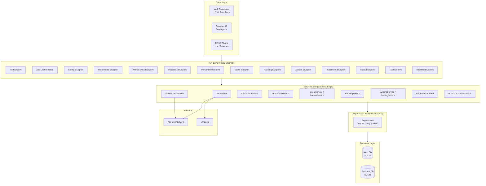
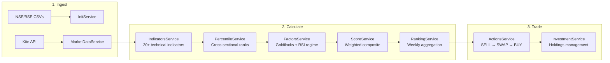
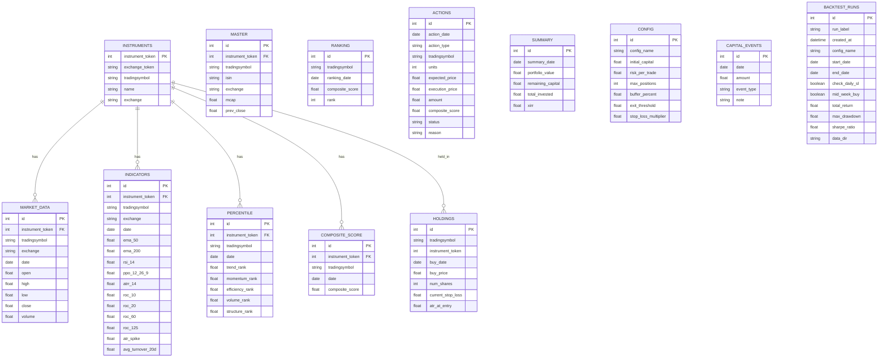
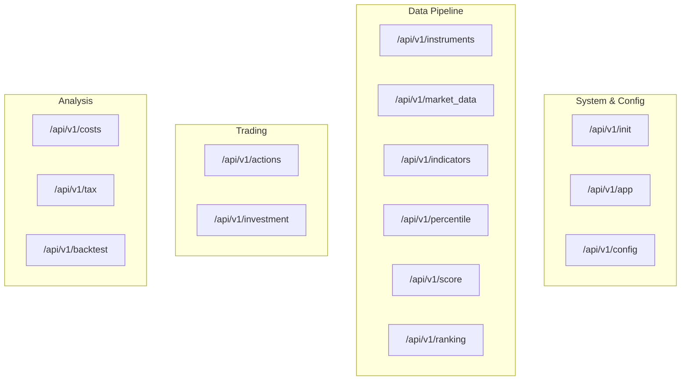

# Architecture

> **Last Updated:** 2026-02-16

System architecture, data flow, database schema, and configuration for Stock Screener V2.

---

## System Architecture

---

## Layered Design

The application follows a strict **Routes → Services → Repositories → Models** layering:

| Layer | Directory | Responsibility |
|-------|-----------|---------------|
| **Routes** | `src/api/v1/routes/` | HTTP handling, request validation (Marshmallow schemas), response formatting. Thin controllers. |
| **Services** | `src/services/` | All business logic: calculations, orchestration, decision-making. No direct DB queries. |
| **Repositories** | `src/repositories/` | Data access: SQLAlchemy queries, bulk inserts, filtering. No business logic. |
| **Models** | `src/models/` | SQLAlchemy ORM table definitions. |
| **Schemas** | `src/schemas/` | Marshmallow schemas for request/response validation and serialization. |
| **Utils** | `src/utils/` | Pure functions: position sizing, stop-loss, transaction costs, tax, metrics. |
| **Config** | `src/config/` | Configuration dataclasses: strategy weights, costs, tax rates, sizing constraints. |

---

## Data Pipeline Flow

The core pipeline transforms raw market data into actionable trade decisions:

### Pipeline Steps

| Step | Service | Input | Output | Table |
|------|---------|-------|--------|-------|
| **1. Init** | `InitService` | NSE/BSE CSVs | Filtered stock universe | `instruments`, `master` |
| **2. Market Data** | `MarketDataService` | Kite API | Daily OHLCV | `market_data` |
| **3. Indicators** | `IndicatorsService` | OHLCV | EMA, RSI, PPO, ATR, etc. | `indicators` |
| **4. Percentiles** | `PercentileService` | Indicators | Cross-sectional ranks (0-100) | `percentile` |
| **5. Scores** | `ScoreService` + `FactorsService` | Percentiles + Indicators | Composite score per stock | `composite_score` |
| **6. Rankings** | `RankingService` | Daily scores | Weekly average + rank | `ranking` |
| **7. Actions** | `ActionsService` | Rankings + Holdings | BUY/SELL/SWAP decisions | `actions` |
| **8. Holdings** | `InvestmentService` | Processed actions | Portfolio state | `holdings`, `summary` |

---

## Database Schema

### Main Database (SQLite)

### Backtest Database

A separate SQLite database (`backtest.db`) is created per backtest run. It mirrors the main DB schema for `holdings`, `actions`, and `summary` tables, allowing isolated simulation without affecting production data.

---

## Configuration System

### Strategy Configuration Classes

All configuration lives in `src/config/strategies_config.py` as dataclasses:

| Class | Purpose | Key Parameters |
|-------|---------|---------------|
| `StrategyParameters` | Factor weights for composite score | `trend_strength_weight=0.30`, `momentum_velocity_weight=0.25`, `risk_efficiency_weight=0.20` |
| `TransactionCostConfig` | Indian market fees | STT, stamp duty, GST, exchange, SEBI, IPF, DP charges |
| `ImpactCostConfig` | Market impact tiers | 4 tiers based on order size vs ADV |
| `PenaltyBoxConfig` | Score disqualification rules | Below EMA200, ATR spike, illiquid |
| `PositionSizingConfig` | Position sizing constraints | Risk per trade, concentration limit, ADV limit |
| `PortfolioControlConfig` | Portfolio-level risk controls | Drawdown pause/reduce, sector limits |
| `TaxConfig` | Capital gains tax (India) | STCG 20%, LTCG 12.5%, ₹1.25L exemption |
| `ChallengerConfig` | Swap decision parameters | Exit threshold, buffer percent |
| `GoldilocksConfig` | Non-linear trend scoring zones | 4 distance-from-EMA zones |
| `RSIRegimeConfig` | Non-linear RSI scoring zones | 5 RSI regime zones |
| `BacktestConfig` | Backtest defaults | Initial capital, max positions |

### Runtime Configuration API

Strategy parameters can also be managed at runtime via the `/api/v1/config/{config_name}` endpoints (GET/PUT/POST). These are stored in the `config` database table and override the static defaults.

---

## API Blueprint Organization

The Flask app registers 14 blueprints in `run.py`, grouped by function:

See [API Reference](API.md) for the complete endpoint documentation.

---

## Key Design Decisions

| Decision | Rationale |
|----------|-----------|
| **Separate backtest DB** | Isolates simulation state from production holdings; allows parallel runs |
| **ActionsService reuse in backtest** | Same trading logic for live and backtest ensures consistency |
| **Friday-anchored rankings** | Weekly rank stability; all dates normalized to nearest Friday |
| **Three-phase action generation** | SELL first frees capital, SWAP optimizes, BUY fills vacancies — order matters |
| **Hard penalty exclusions** | Immediate score of 0 for stocks below EMA 50, EMA 200, low liquidity, or penny stocks |
| **Multi-constraint position sizing** | Most restrictive of ATR risk / minimum value wins |
| **Repository pattern** | Clean separation between business logic and DB queries; enables DB injection for backtest |
