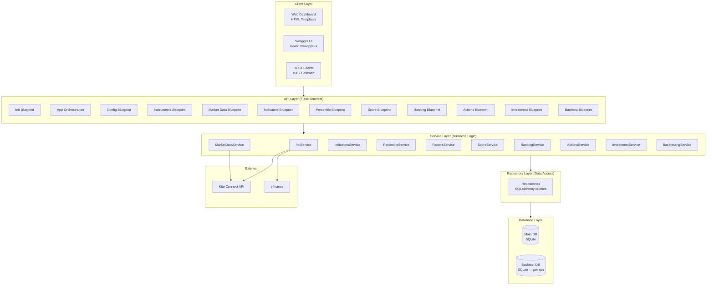
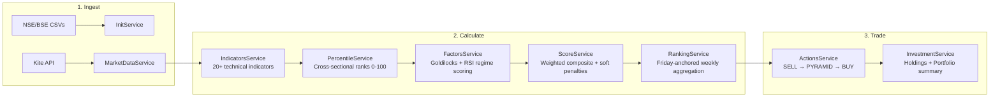
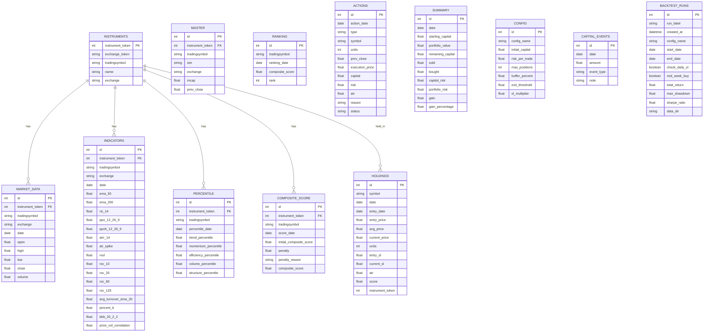
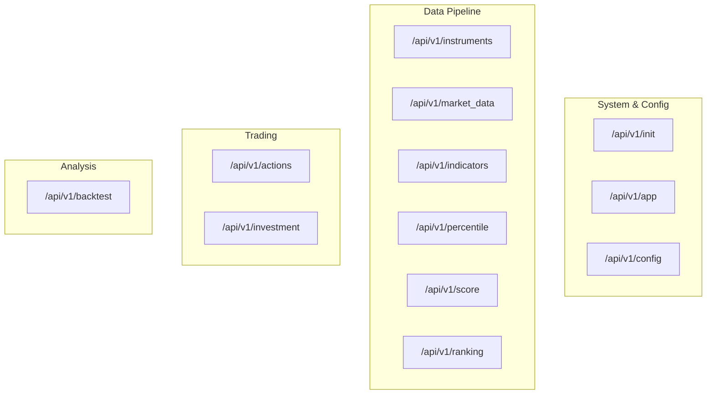

# Architecture

> **Last Updated:** 2026-05-03

System architecture, data flow, database schema, and configuration for Stock Screener V2.

---

## System Architecture

The application follows a strict layered architecture with no layer skipping.

```mermaid
flowchart TD
    subgraph Client["Client Layer"]
        DASH[Web Dashboard\nHTML Templates]
        SWAGGER[Swagger UI\n/api/v1/swagger-ui]
        CURL[REST Clients\ncurl / Postman]
    end

    subgraph API["API Layer (Flask-Smorest)"]
        direction TB
        BP1[Init Blueprint]
        BP2[App Orchestration]
        BP3[Config Blueprint]
        BP4[Instruments Blueprint]
        BP5[Market Data Blueprint]
        BP6[Indicators Blueprint]
        BP7[Percentile Blueprint]
        BP8[Score Blueprint]
        BP9[Ranking Blueprint]
        BP10[Actions Blueprint]
        BP11[Investment Blueprint]
        BP12[Backtest Blueprint]
    end

    subgraph Services["Service Layer (Business Logic)"]
        S1[InitService]
        S2[MarketDataService]
        S3[IndicatorsService]
        S4[PercentileService]
        S5[FactorsService]
        S6[ScoreService]
        S7[RankingService]
        S8[ActionsService]
        S9[InvestmentService]
        S10[BacktestingService]
    end

    subgraph Repos["Repository Layer (Data Access)"]
        R[Repositories\nSQLAlchemy queries]
    end

    subgraph DB["Database Layer"]
        MAIN[(Main DB\nSQLite)]
        BTDB[(Backtest DB\nSQLite — per run)]
    end

    subgraph External["External"]
        KITE[Kite Connect API]
        YF[yfinance]
    end

    Client --> API
    API --> Services
    Services --> Repos
    Repos --> DB
    S1 & S2 --> KITE
    S1 --> YF
```

---

## Layered Design

| Layer | Directory | Responsibility |
|-------|-----------|---------------|
| **Routes** | `src/api/v1/routes/` | HTTP handling, request validation (Marshmallow schemas), response formatting. Thin controllers — no business logic. |
| **Services** | `src/services/` | All business logic: calculations, orchestration, decision-making. No direct DB queries. |
| **Repositories** | `src/repositories/` | Data access: SQLAlchemy queries, bulk inserts, filtering. No business logic. |
| **Models** | `src/models/` | SQLAlchemy ORM table definitions. |
| **Schemas** | `src/schemas/` | Marshmallow schemas for request/response validation and serialization. |
| **Utils** | `src/utils/` | Pure functions: position sizing, stop-loss calculation, FIFO matching, performance metrics. |
| **Config** | `src/config/` | Configuration dataclasses: strategy factor weights, sizing constraints, Goldilocks/RSI zones. |

---

## Data Pipeline Flow

The core pipeline transforms raw market data into actionable trade decisions through a sequential series of enrichment steps:

```mermaid
flowchart LR
    subgraph Ingest["1. Ingest"]
        CSV[NSE/BSE CSVs] --> INIT[InitService]
        KITE[Kite API] --> MDS[MarketDataService]
    end

    subgraph Calculate["2. Calculate"]
        MDS --> IND[IndicatorsService\n20+ technical indicators]
        IND --> PCT[PercentileService\nCross-sectional ranks 0-100]
        PCT --> FAC[FactorsService\nGoldilocks + RSI regime scoring]
        FAC --> SCR[ScoreService\nWeighted composite + soft penalties]
        SCR --> RNK[RankingService\nFriday-anchored weekly aggregation]
    end

    subgraph Trade["3. Trade"]
        RNK --> ACT[ActionsService\nSELL → PYRAMID → BUY]
        ACT --> INV[InvestmentService\nHoldings + Portfolio summary]
    end
```

### Pipeline Steps

| Step | Service | Input | Output | Table |
|------|---------|-------|--------|-------|
| **1. Init** | `InitService` | NSE/BSE CSVs + yfinance | Filtered stock universe | `instruments`, `master` |
| **2. Market Data** | `MarketDataService` | Kite Connect API | Daily OHLCV | `market_data` |
| **3. Indicators** | `IndicatorsService` | OHLCV | EMA, RSI, PPO, ATR, RVOL... | `indicators` |
| **4. Percentiles** | `PercentileService` | Indicators | Cross-sectional ranks (0-100) | `percentile` |
| **5. Factors** | `FactorsService` | Percentiles | Non-linear Goldilocks/RSI scores | *(in-memory)* |
| **6. Scores** | `ScoreService` | Percentiles + Indicators | Composite score per stock (with soft penalties) | `composite_score` |
| **7. Rankings** | `RankingService` | Daily scores | Weekly average + rank | `ranking` |
| **8. Actions** | `ActionsService` | Rankings + Holdings | BUY/SELL/SWAP decisions | `actions` |
| **9. Holdings** | `InvestmentService` | Processed actions | Portfolio state + summary | `holdings`, `summary` |

---

## Database Schema

### Main Database (SQLite)

```mermaid
erDiagram
    INSTRUMENTS {
        int instrument_token PK
        string exchange_token
        string tradingsymbol
        string name
        string exchange
    }

    MASTER {
        int id PK
        int instrument_token FK
        string tradingsymbol
        string isin
        string exchange
        float mcap
        float prev_close
    }

    MARKET_DATA {
        int id PK
        int instrument_token FK
        string tradingsymbol
        string exchange
        date date
        float open
        float high
        float low
        float close
        float volume
    }

    INDICATORS {
        int id PK
        int instrument_token FK
        string tradingsymbol
        string exchange
        date date
        float ema_50
        float ema_200
        float rsi_14
        float ppo_12_26_9
        float ppoh_12_26_9
        float atrr_14
        float atr_spike
        float rvol
        float roc_10
        float roc_20
        float roc_60
        float roc_125
        float avg_turnover_ema_20
        float percent_b
        float bbb_20_2_2
        float price_vol_correlation
    }

    PERCENTILE {
        int id PK
        int instrument_token FK
        string tradingsymbol
        date percentile_date
        float trend_percentile
        float momentum_percentile
        float efficiency_percentile
        float volume_percentile
        float structure_percentile
    }

    COMPOSITE_SCORE {
        int id PK
        int instrument_token FK
        string tradingsymbol
        date score_date
        float initial_composite_score
        float penalty
        string penalty_reason
        float composite_score
    }

    RANKING {
        int id PK
        string tradingsymbol
        date ranking_date
        float composite_score
        int rank
    }

    ACTIONS {
        int id PK
        date action_date
        string type
        string symbol
        int units
        float prev_close
        float execution_price
        float capital
        float risk
        float atr
        string reason
        string status
    }

    HOLDINGS {
        int id PK
        string symbol
        date date
        date entry_date
        float entry_price
        float avg_price
        float current_price
        int units
        float entry_sl
        float current_sl
        float atr
        float score
        int instrument_token
    }

    SUMMARY {
        int id PK
        date date
        float starting_capital
        float portfolio_value
        float remaining_capital
        float sold
        float bought
        float capital_risk
        float portfolio_risk
        float gain
        float gain_percentage
    }

    CONFIG {
        int id PK
        string config_name
        float initial_capital
        float risk_per_trade
        int max_positions
        float buffer_percent
        float exit_threshold
        float sl_multiplier
    }

    CAPITAL_EVENTS {
        int id PK
        date date
        float amount
        string event_type
        string note
    }

    BACKTEST_RUNS {
        int id PK
        string run_label
        datetime created_at
        string config_name
        date start_date
        date end_date
        boolean check_daily_sl
        boolean mid_week_buy
        float total_return
        float max_drawdown
        float sharpe_ratio
        string data_dir
    }

    INSTRUMENTS ||--o{ MARKET_DATA : has
    INSTRUMENTS ||--o{ INDICATORS : has
    INSTRUMENTS ||--o{ PERCENTILE : has
    INSTRUMENTS ||--o{ COMPOSITE_SCORE : has
    INSTRUMENTS ||--o{ HOLDINGS : held_in
```

### Backtest Database

A **separate SQLite database** (`backtest.db`) is created per backtest run inside its own directory under `backtest_history/`. It mirrors the main DB schema for `holdings`, `actions`, `capital_events`, and `summary` tables, allowing isolated simulation without touching production data.

The backtest engine injects a session pointing at this isolated DB into the same `ActionsService` and `InvestmentService` used in production, ensuring 100% logic parity.

> **Prerequisite:** Historical market data and rankings must already be calculated in the main DB for the simulation period before running a backtest.

---

## Configuration System

### Strategy Configuration Classes

All configuration lives in `src/config/strategies_config.py` as Python dataclasses:

| Class | Purpose | Key Parameters |
|-------|---------|---------------|
| `StrategyParameters` | Factor weights for composite score | `trend_strength_weight=0.30`, `momentum_velocity_weight=0.25`, `conviction_weight=0.15` |
| `Strategy2Parameters` | Alternative factor weights (strategy variant) | Same shape as above with different weights |
| `GoldilocksConfig` | Non-linear trend scoring zones | 4 distance-from-EMA zones |
| `RSIRegimeConfig` | Non-linear RSI scoring zones | 5 RSI regime zones |
| `PyramidConfig` | Pyramid add parameters | `pyramid_fraction` — fraction of capital for add-on |

### Runtime Configuration API

Strategy parameters can also be managed at runtime via the `/api/v1/config/{config_name}` endpoints (GET/PUT). These are stored in the `config` database table and override static defaults. The config name `momentum_config` is the default.

---

## API Blueprint Organization

The Flask app registers 14 blueprints in `run.py`:

```mermaid
flowchart TD
    subgraph System["System & Config"]
        INIT["/api/v1/init"]
        APP["/api/v1/app"]
        CFG["/api/v1/config"]
    end

    subgraph DataPipeline["Data Pipeline"]
        INST["/api/v1/instruments"]
        MD["/api/v1/market_data"]
        INDI["/api/v1/indicators"]
        PCT["/api/v1/percentile"]
        SCR["/api/v1/score"]
        RNK["/api/v1/ranking"]
    end

    subgraph TradingOps["Trading"]
        ACT["/api/v1/actions"]
        INV["/api/v1/investment"]
    end

    subgraph AnalysisOps["Analysis"]
        BT["/api/v1/backtest"]
    end
```

See [API Reference](API.md) for the complete endpoint documentation.

---

## Key Design Decisions

| Decision | Rationale |
|----------|-----------|
| **Separate backtest DB** | Isolates simulation state from production holdings; allows parallel runs |
| **ActionsService reuse in backtest** | Same trading logic for live and backtest — no logic drift |
| **Friday-anchored rankings** | Weekly rank stability; all indicator lookups are normalized to nearest preceding Friday |
| **Three-phase action generation** | SELL first frees capital; PYRAMID on winners; BUY fills vacancies — order strictly matters |
| **Soft penalties (not hard zero)** | Allows stocks near a support level to still rank, just demoted; avoids cliff-edge behavior |
| **Capital from first principles** | `remaining_capital` is computed as `capital_events - cost_basis`, not from a potentially drifted summary column |
| **Repository pattern** | Clean separation between business logic and DB queries; enables DB injection for backtest isolation |
| **Waitress server** | Production-grade WSGI server with threading support for concurrent SSE streams + API requests |
