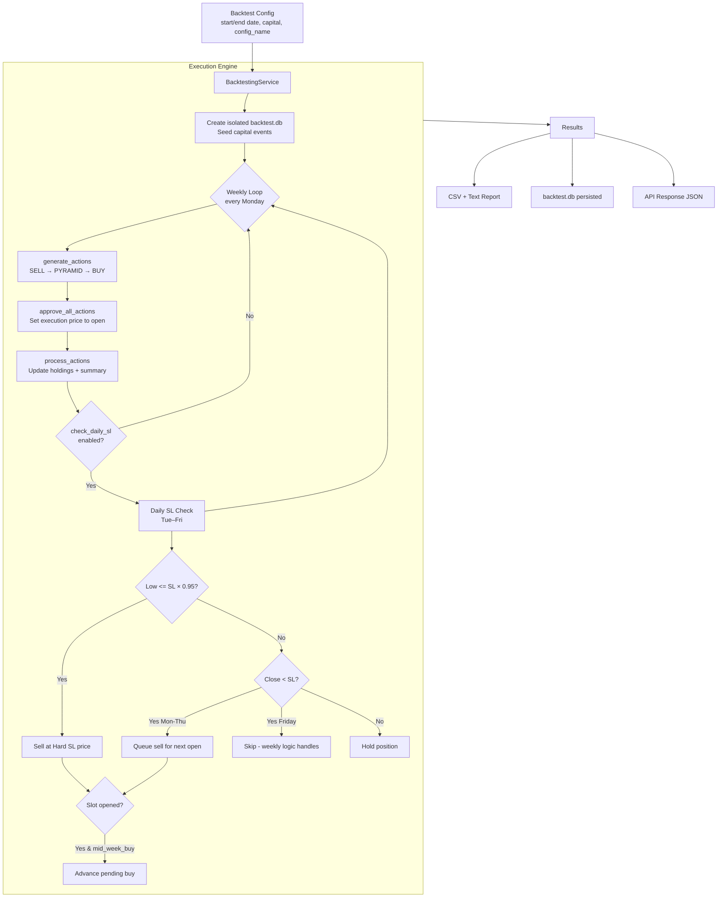
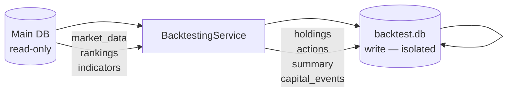
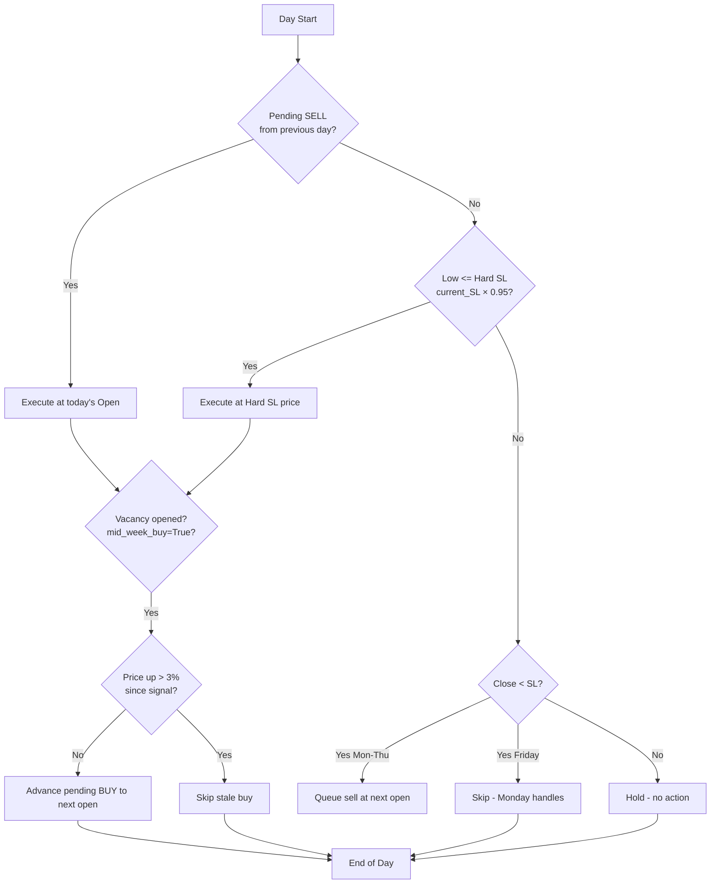

# Backtesting Engine

> **Last Updated:** 2026-05-03

The **Backtesting Engine** simulates the trading strategy over historical data to validate performance, measure drawdowns, and compute risk metrics — without affecting any production data.

---

## 🏗️ Backtest Architecture

The engine uses the **same `ActionsService` and `InvestmentService`** as the live system, but injects a separate SQLite session pointing at an isolated `backtest.db`. This guarantees that backtest results reflect real strategy behavior, not a simplified simulation.



---

## 🕹️ Backtest Modes

### Daily SL Mode (`check_daily_sl=True`) — Recommended

Simulates realistic daily monitoring. For each trading day:

1. **Hard SL check**: If today's `Low ≤ current_SL × 0.95`, the position is exited immediately at the hard SL price (intraday execution).
2. **Close SL check**: If today's `Close < current_SL` (Mon–Thu only), a sell is queued for the next day's open.
3. **Mid-week buy** (if `mid_week_buy=True`): When a stop-loss creates a vacancy, the engine attempts to advance a pending BUY to fill it — but only if the stock hasn't already run up more than 3% since the signal (stale guard).

Friday close-SL hits are skipped because the weekly action generation on the next Monday will handle them.

### Weekly-Only Mode (`check_daily_sl=False`)

Checks stops and rankings on Monday only. No mid-week actions.

- Faster to run
- Less realistic for volatile momentum strategies
- Useful for long-term "coffee can" style testing

---

## 🚀 Running a Backtest

### Via API

```
POST /api/v1/backtest/run
```

Required: `start_date`, `end_date`
Optional: `initial_capital`, `config_name`, `check_daily_sl`, `mid_week_buy`

### Via Dashboard

1. Go to `http://localhost:5000/backtest`
2. Select date range and config.
3. Click **Run Backtest**.

> **Prerequisite:** Market data and rankings must be pre-calculated in the main DB for the full simulation period. Run the data pipeline first.

---

## 📊 Result Interpretation

Results are returned as JSON and also saved as a text report at `backtest_history/<run_id>/Backtest_Report_YYYYMMDD.txt`.

### Key Metrics

| Metric | Description | Target |
|--------|-------------|--------|
| **CAGR** | Compound Annual Growth Rate | > Nifty 50 benchmark |
| **Max Drawdown** | Largest peak-to-trough decline | < 20–25% |
| **Sharpe Ratio** | Risk-adjusted return (annual) | > 1.0 |
| **Win Rate** | % of profitable closed trades | > 50% |
| **Profit Factor** | Gross Profit / Gross Loss | > 1.5 |
| **Expectancy** | Average ₹ P&L per trade | > 0 |

### Trade Journal

Each closed trade in the journal includes:
- Entry / exit date and price
- Units traded, P&L (after costs), return %
- Holding period in days
- Exit trigger reason (e.g., `stoploss`, `swap`, `ranking_drop`)

### Backtest History

Every completed run is saved to the main DB's `backtest_runs` table with summary metadata. Retrieve past runs with:
- `GET /api/v1/backtest/history` — list all runs
- `GET /api/v1/backtest/history/{id}` — full results including equity curve and trade log

---

## 🛠️ Data Handling



- **Market data, rankings, indicators**: Read from the main DB (never modified).
- **Holdings, actions, summary, capital events**: Written to the isolated `backtest.db` for the run.
- **Results files**: Stored in `backtest_history/<run_id>/` on disk.

---

## 📝 Daily SL Logic — Detailed Flow



---

## ⚠️ Known Limitations

| Limitation | Details |
|-----------|---------|
| **Survivorship bias** | Uses static NSE/BSE CSV snapshots. Delisted stocks are not removed retroactively. |
| **No corporate action adjustment** | Stock splits and bonuses are not automatically adjusted in historical data. |
| **Impact cost** | Slippage is modeled as transaction costs only. Large-order impact is not simulated. |
| **Single-pass** | Not a walk-forward backtest. Results may overfit to the specific historical period. |

These are tracked as future improvements in [pending_items.md](pending_items.md).
