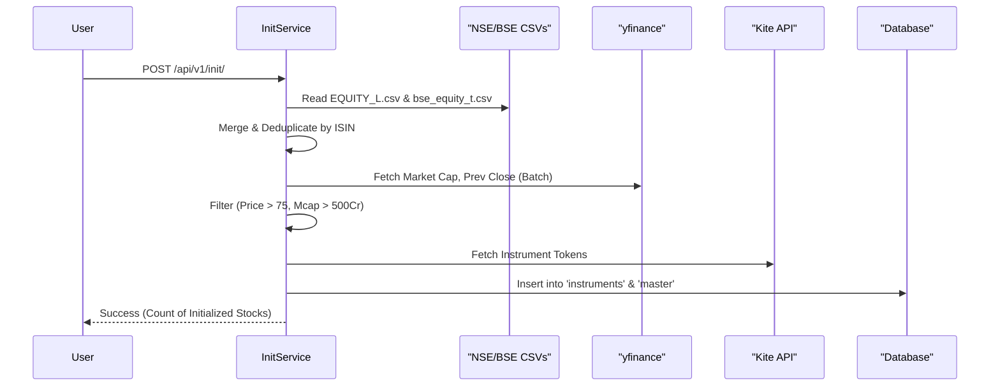

# Day 0 Setup

> **Last Updated:** 2026-02-16

The **Day 0** process initializes your stock universe. It downloads instrument lists from NSE/BSE, filters them for quality (liquidity, price, market cap), and populates the master database.

This must be done **once** when setting up the app, and periodically (e.g., monthly) to capture new listings or delistings.

---

## 🔄 Initialization Flow



---

## 📝 Step 1: Download Data

You need to manually download two CSV files and place them in the `data/` directory.

### 1. NSE Equity List
- **Source**: [NSE Market Data](https://www.nseindia.com/market-data/securities-available-for-trading)
- **File**: `EQUITY_L.csv`
- **Action**: Download and save to `data/EQUITY_L.csv`

### 2. BSE Active Scrips
- **Source**: [BSE Listed Companies](https://www.bseindia.com/corporates/List_Scrips.html)
- **Settings**: Select **Segment**: "Equity" and **Status**: "Active" (or Group T/A as preferred)
- **File**: `bse_equity.csv` (rename if needed)
- **Action**: Save to `data/bse_equity_t.csv`

> **Note**: The code specifically looks for `data/EQUITY_L.csv` and `data/bse_equity_t.csv`.

---

## ⚙️ Step 2: Run Initialization

You can trigger initialization via the API or the dashboard.

### Option A: Via API (Curl / Postman)

```bash
curl -X POST http://localhost:5000/api/v1/init/
```

### Option B: Via Dashboard
1. Go to `http://localhost:5000/`
2. Click the **"Initialize System (Day 0)"** button.

### Option C: Via Pipeline Endpoint
You can also run it as part of a full pipeline run:

```bash
curl -X POST http://localhost:5000/api/v1/app/run-pipeline \
     -H "Content-Type: application/json" \
     -d '{"init": true, "marketdata": false, "indicators": false}'
```

---

## 🔍 Filtering Rules

The `InitService` applies strict filters to ensure only tradeable, liquid, and high-quality stocks enter your universe:

| Filter | Threshold | Reason |
|--------|-----------|--------|
| **Minimum Price** | > ₹75 | Avoid penny stocks and manipulation prone scrips |
| **Minimum Market Cap** | > ₹500 Cr | Ensure sufficient company size and stability |
| **Asset Class** | != "Mutual Fund" | Exclude ETFs and MF units (focus on equity) |
| **Issuer** | != "Asset Management" | Double check to exclude ETFs |
| **Market Data** | Must have Kite Token | Ensure trade execution is possible via Kite |

*These thresholds are defined in `src/services/init_service.py` and can be customized there.*

---

## ✅ Step 3: Verify Results

After the process completes (it may take 1-2 minutes due to yfinance fetching):

1. **Check Instrument Count**:
   ```bash
   curl http://localhost:5000/api/v1/instruments
   # Should return ~1500-2000 instruments
   ```

2. **Check Database**:
   Open `instance/stocks.db` and query:
   ```sql
   SELECT COUNT(*) FROM instruments;
   SELECT * FROM master LIMIT 5;
   ```

---

## ⚠️ Common Issues

1. **"FileNotFoundError"**:
   - Ensure you placed the CSVs in the `data/` folder (root level).
   - Check filenames exactly match `EQUITY_L.csv` and `bse_equity_t.csv`.

2. **"Kite Token Missing"**:
   - The initialization requires Kite API headers to fetch instrument tokens.
   - Ensure `local_secrets.py` is set up and `KiteConnect` can authenticate.
   
3. **"yfinance Timeout"**:
   - Bulk fetching market cap can sometimes time out.
   - The script has retries, but if it fails, check your internet connection and try again.
