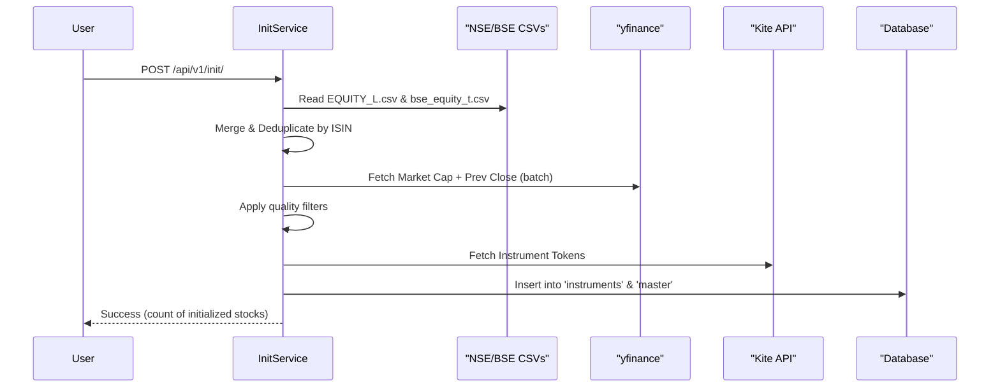

# Day 0 Setup

> **Last Updated:** 2026-05-03

The **Day 0** process initializes your stock universe. It reads instrument lists from NSE and BSE, fetches market cap data from yfinance, filters for quality (liquidity, price, size), and populates the master database.

This must be run **once** when setting up the app for the first time, and periodically (e.g., monthly) to capture new listings or delistings.

---

## 🔄 Initialization Flow


```mermaid
sequenceDiagram
    participant User
    participant InitService
    participant NSE_BSE as "NSE/BSE CSVs"
    participant YF as "yfinance"
    participant Kite as "Kite API"
    participant DB as "Database"

    User->>InitService: POST /api/v1/init/
    InitService->>NSE_BSE: Read EQUITY_L.csv & bse_equity_t.csv
    InitService->>InitService: Merge & Deduplicate by ISIN
    InitService->>YF: Fetch Market Cap + Prev Close (batch)
    InitService->>InitService: Apply quality filters
    InitService->>Kite: Fetch Instrument Tokens
    InitService->>DB: Insert into 'instruments' & 'master'
    InitService-->>User: Success (count of initialized stocks)
```

---

## 📝 Step 1: Download Data Files

You must manually download two CSV files and place them in the `data/` directory in the project root.

### NSE Equity List

- **Source**: [NSE Market Data — Securities Available for Trading](https://www.nseindia.com/market-data/securities-available-for-trading)
- **File to save as**: `data/EQUITY_L.csv`

### BSE Active Scrips

- **Source**: [BSE — List of Scrips](https://www.bseindia.com/corporates/List_Scrips.html)
- **Settings**: Segment = "Equity", Status = "Active"
- **File to save as**: `data/bse_equity_t.csv`

> The code expects these exact filenames. Rename if necessary after downloading.

---

## ⚙️ Step 2: Run Initialization

### Option A: Via Dashboard (easiest)

1. Go to `http://localhost:5000/`
2. Click the **"Initialize System (Day 0)"** button.

### Option B: Via API

```bash
curl -X POST http://localhost:5000/api/v1/init/
```

### Option C: As Part of Pipeline

```bash
curl -X POST http://localhost:5000/api/v1/app/run-pipeline \
     -H "Content-Type: application/json" \
     -d '{"init": true, "marketdata": false, "indicators": false, "percentile": false, "score": false, "ranking": false}'
```

> This process takes 1–3 minutes because yfinance fetches market cap data in batches over the internet.

---

## 🔍 Filtering Rules

`InitService` applies strict filters to ensure only tradeable, liquid, and institutionally sized stocks enter the universe:

| Filter | Threshold | Reason |
|--------|-----------|--------|
| **Minimum Price** | > ₹75 | Avoid penny stocks and manipulation-prone scrips |
| **Minimum Market Cap** | > ₹500 Cr | Ensure sufficient company size and liquidity depth |
| **Asset Class** | != "Mutual Fund" | Exclude ETFs and MF units |
| **Issuer Type** | != "Asset Management" | Double-checks ETF exclusion |
| **Kite Token** | Must exist | Ensure trade execution is possible via Kite Connect |

These thresholds are defined in `src/services/init_service.py` and can be adjusted there if needed.

---

## ✅ Step 3: Verify Results

After the process completes:

**1. Check instrument count via API:**

```bash
curl http://localhost:5000/api/v1/instruments
```

Expect roughly 1,500–2,000 instruments.

**2. Query the database directly:**

Open `instance/stocks.db` with any SQLite viewer and run:
```sql
SELECT COUNT(*) FROM instruments;
SELECT COUNT(*) FROM master;
SELECT tradingsymbol, mcap, exchange FROM master LIMIT 10;
```

---

## ⚠️ Common Issues

### `FileNotFoundError`

Ensure both files are in the `data/` folder at the project root with exactly the names `EQUITY_L.csv` and `bse_equity_t.csv`.

### `Kite Token Missing / API Error`

The initialization requires a valid Kite Connect session to fetch instrument tokens. Ensure:
- `local_secrets.py` contains valid API Key and Secret.
- You have completed the OAuth flow (visited the login URL) and have a valid access token.

### `yfinance Timeout`

Bulk market cap fetching can be slow or time out on poor connections. The script retries internally, but if repeated failures occur, check your internet connection and re-run. The init process is idempotent — re-running it will upsert without creating duplicates.

### Low Stock Count (< 1000)

If significantly fewer than expected stocks are returned:
- Check that you downloaded both NSE and BSE CSVs (not just one).
- Verify the BSE file has the correct "Active" / "Equity" filter applied before downloading.
- Check yfinance API for any rate limiting or data gaps.
