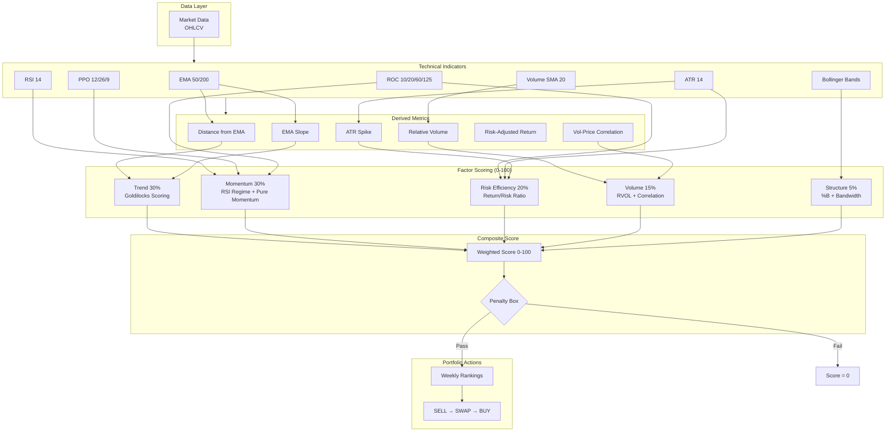
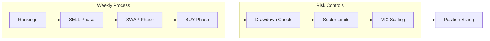

# Stock Screener - Strategy & Indicators Documentation

> **Last Updated:** 2026-02-08

A momentum-based multi-factor scoring system for Indian equity markets.

---

## Strategy Architecture



---

## Technical Indicators

### Trend Indicators

| Indicator | Formula | Purpose |
|-----------|---------|---------|
| **EMA 50** | 50-day Exponential MA | Short-term trend |
| **EMA 200** | 200-day Exponential MA | Long-term trend filter |
| **EMA Slope** | (EMA50 - EMA50[5]) / EMA50[5] | Trend velocity |
| **Distance from EMA** | (Close - EMA) / EMA | Trend extension |

### Momentum Indicators

| Indicator | Formula | Purpose |
|-----------|---------|---------|
| **RSI 14** | Relative Strength Index | Momentum strength |
| **RSI Signal** | 3-day EMA of RSI | Smoothed for regime |
| **PPO 12/26/9** | (EMA12 - EMA26) / EMA26 × 100 | Price oscillator |
| **ROC 10/20** | Rate of change | Short-term momentum |
| **ROC 60** | ~3 month return | Pure momentum |
| **ROC 125** | ~6 month return | Pure momentum |

### Volatility Indicators

| Indicator | Formula | Purpose |
|-----------|---------|---------|
| **ATR 14** | Average True Range | Position sizing, stops |
| **ATR Spike** | ATR / ATR_20_avg | Earnings/news detection |
| **BBands 20/2** | 20-period, 2 std dev | Volatility bands |
| **BBB (Bandwidth)** | (Upper - Lower) / Middle | Volatility regime |
| **%B** | (Close - Lower) / (Upper - Lower) | Band position |

### Volume Indicators

| Indicator | Formula | Purpose |
|-----------|---------|---------|
| **VOL SMA 20** | 20-day volume average | Baseline |
| **RVOL** | Volume / VOL_SMA_20 | Relative volume |
| **Vol-Price Corr** | 10-day correlation | Accumulation/distribution |

---

## Factor Calculations

### 1. Trend Factor (30%)

**Goldilocks Scoring** - Non-linear distance from 200 EMA:

| Distance | Score | Interpretation |
|----------|-------|----------------|
| < 0% | 0 | Below EMA (bearish) |
| 0-10% | 70→85 | Early breakout |
| 10-35% | 85→100 | **Sweet spot** |
| 35-50% | 100→60 | Extended |
| > 50% | 60→0 | Over-extended |

### 2. Momentum Factor (30%)

**RSI Regime Mapping:**

| RSI | Score | Interpretation |
|-----|-------|----------------|
| < 40 | 0 | Weak |
| 40-50 | 0→30 | Recovering |
| 50-70 | 30→100 | **Sweet spot** |
| 70-85 | 100→90 | Strong |
| > 85 | 90→60 | Overbought |

**Composition:** 40% RSI + 30% PPO + 30% Pure Momentum (avg ROC_60 + ROC_125)

### 3. Risk Efficiency Factor (20%)

```
efficiency = (ROC_20 / (ATR/Price)) × spike_penalty
spike_penalty = 0.5 if ATR_spike > 2.0 else 1.0
```

### 4. Volume Factor (15%)

```
volume_score = 60% × RVOL_norm + 40% × correlation_norm
```

### 5. Structure Factor (5%)

**%B Scoring:**

| %B | Score |
|----|-------|
| < 0.5 | 20 |
| 0.5-0.7 | 20→60 |
| 0.7-1.1 | 60→100 |
| > 1.1 | 100→70 |

---

## Composite Score

```
composite_score = Σ (factor_score × weight)

Weights:
- Trend:      30%
- Momentum:   30%
- Efficiency: 20%
- Volume:     15%
- Structure:   5%
```

---

## Penalty Box Rules

Score set to **0** if any condition met:

| Rule | Threshold | Reason |
|------|-----------|--------|
| Below EMA | Price < EMA_200 | Not in uptrend |
| ATR Spike | ATR_spike > 2.0 | Volatility shock |
| Illiquid | Turnover < ₹5 Cr | Low liquidity |

---

## Trading Strategy

### Weekly Rebalancing Phases



1. **SELL Phase:** Exit if stop-loss hit or score < exit_threshold
2. **SWAP Phase:** Replace incumbent if challenger_score > incumbent × 1.10
3. **BUY Phase:** Fill vacancies from top-ranked

### Stop-Loss System (Hybrid)

**ATR Trailing:**
```
new_stop = current_price - (ATR × sl_multiplier)
effective_stop = max(new_stop, previous_stop)  # Only moves up
```

**Hard Trailing (10% increments):**
```
tiers = floor(gain_percent / 0.10)
hard_stop = initial_stop × (1 + 0.10 × tiers)
```

**Combined:** `effective_stop = MAX(atr_stop, hard_stop)`

### Champion vs Challenger

```
Swap if: challenger_score > incumbent_score × (1 + buffer_percent)
Default buffer: 10%
```

---

## Position Sizing

Multi-constraint sizing (most restrictive wins):

1. **ATR Risk:** `shares = (portfolio × risk%) / (ATR × stop_mult)`
2. **Liquidity:** max 5% of 20-day ADV
3. **Concentration:** max 12% of portfolio
4. **Minimum:** skip if < 2% of portfolio

---

## Portfolio Controls

| Control | Threshold | Action |
|---------|-----------|--------|
| Drawdown 15% | Pause | No new entries |
| Drawdown 20% | Reduce | Scale to 70% |
| Sector | 40% max | Diversify |
| VIX 20-25 | Elevated | Scale to 85% |
| VIX > 25 | High | Scale to 70% |

---

## Configuration Parameters

| Parameter | Default | Description |
|-----------|---------|-------------|
| `initial_capital` | ₹100,000 | Starting capital |
| `risk_per_trade` | 1% | Per-trade risk |
| `max_positions` | 15 | Max holdings |
| `buffer_percent` | 10% | Swap threshold |
| `exit_threshold` | 40 | Sell if score below |
| `sl_multiplier` | 2 | ATR × multiplier |

---

## Key Files

| File | Purpose |
|------|---------|
| `indicators_service.py` | Calculate 20+ indicators |
| `factors_service.py` | Goldilocks/RSI scoring |
| `score_service.py` | Composite score |
| `strategy_service.py` | Trading logic |
| `portfolio_controls_service.py` | Risk controls |
