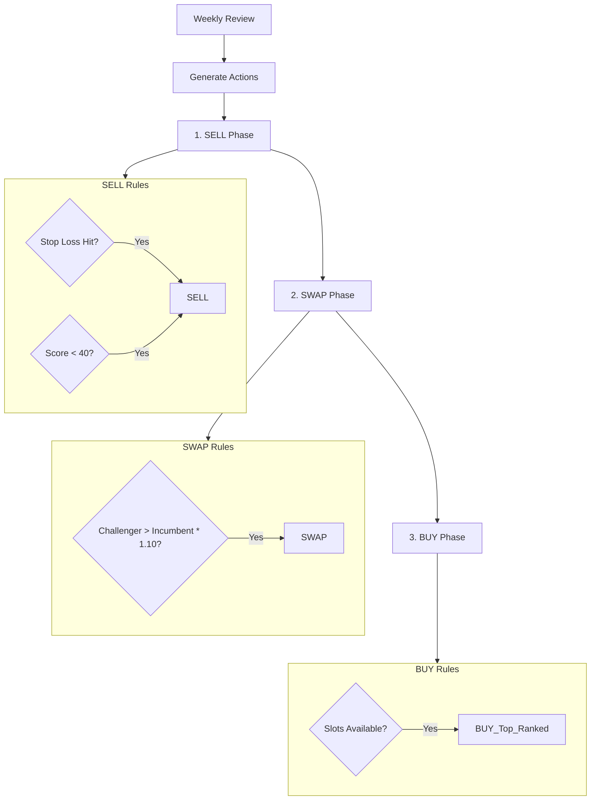

# Strategy Guide

> **Last Updated:** 2026-02-16

Comprehensive guide to the momentum-based multi-factor scoring system, trading logic, and risk controls.

---

## 🧠 Strategy Philosophy

The core philosophy is **"Goldilocks Momentum"**:
1. **Trend**: Buy stocks in a steady uptrend (not too steep, not too flat).
2. **Momentum**: Buy when RSI is in the "sweet spot" (50-70), avoiding overbought extremes (>85).
3. **Efficiency**: Prefer smooth curves (low volatility) over jagged spikes.
4. **Volume**: Ensure price moves are supported by volume conviction.
5. **Structure**: Use Bollinger Band structure to time entries.

---

## 📊 Factor Scoring Model

The composite score (0-100) is a weighted sum of 5 factors.

**Weights:**
| Factor | Weight | Components |
|--------|--------|------------|
| **Trend** | **30%** | EMA Slope (60%), Trend Extension (40%) |
| **Momentum** | **25%** | RSI (60%), PPO (20%), Pure Momentum (10%), PPO Hist (10%) |
| **Risk Efficiency** | **20%** | ROC/ATR Ratio |
| **Volume** | **15%** | Relative Volume (70%), Price-Vol Correlation (30%) |
| **Structure** | **10%** | %B (50%), Bandwidth (50%) |

### 1. Trend Factor (Goldilocks Scoring)
We penalize price if it gets too far from the 200-day EMA (overextended).

| Distance from EMA 200 | Score Zone | Logic |
|-----------------------|------------|-------|
| < 0% | 0 | **Bearish** (Below 200 EMA) |
| 0% - 10% | 70 → 85 | **Early Trend** (Building up) |
| **10% - 35%** | **85 → 100** | **Sweet Spot (Goldilocks)** |
| 35% - 50% | 100 → 60 | **Extended** (Risk of mean reversion) |
| > 50% | 60 → 0 | **Over-Extended** (Bubble territory) |

### 2. Momentum Factor (RSI Regime)
We map RSI levels to scores to capture sustainable momentum.

| RSI (14) | Score Zone | Logic |
|----------|------------|-------|
| < 40 | 0 | **Bearish** |
| 40 - 50 | 0 → 30 | **Recovery** |
| **50 - 70** | **30 → 100** | **Bullish Sweet Spot** |
| 70 - 85 | 100 → 90 | **Strong** (Watch for exhaustion) |
| > 85 | 90 → 60 | **Overbought** (Capped at 60) |

---

## 🚫 Penalty Box Rules

A stock is assigned a **Score of 0** (disqualified) if:

1. **Below EMA 200**: Price < EMA 200 (Major trend is down).
2. **ATR Spike**: Current ATR > 2.0x of 20-day average ATR (High volatility event / earnings shock).
3. **Low Liquidity**: Average daily turnover < ₹1 Crore.

**Soft Penalties (Score Multipliers):**
- Below EMA 50: **0.7x** penalty
- Below EMA 200 (if enabled): **0.5x** penalty

---

## 🔄 Trading Logic

### Logic Flow

### 1. SELL Phase
Close positions if:
- **Stop Loss Hit**: Price < (Entry Price - 2x ATR) OR Hard SL hit.
- **Score Degradation**: Composite Score drops below **40**.

### 2. SWAP Phase (Champion vs Challenger)
Replace an existing holding ("Incumbent") with a new candidate ("Challenger") only if:
- **Challenger Score** > **Incumbent Score** + **10% Buffer**
- *Example*: If held stock has score 80, new stock needs > 88 to swap.
- Prevents over-trading (churn) for marginal gains.

### 3. BUY Phase
Fill any remaining empty slots in the portfolio (up to `max_positions`) with the highest-ranked available stocks.

---

## 🛑 Stop-Loss System

We use a **Hybrid Stop-Loss** system combining volatility and hard limits.

1. **ATR Trailing Stop**:
   - `Initial SL = Entry Price - (2.0 × ATR)`
   - Trails up only, never moves down.

2. **Hard Trailing Step (10%)**:
   - Locks in profit every 10% gain.
   - `Hard SL = Entry Price × (1 + 0.10 × N)`

3. **Intraday Hard SL (Disaster Exit)**:
   - If `Low` touches `SL × 0.95` (5% below SL), exit immediately intraday.

---

## ⚖️ Position Sizing

Position size is calculated based on **Risk Management**:

`Shares = (Total Capital × Risk Per Trade %) / (ATR × Stop Multiplier)`

**Constraints (Most Restrictive Wins):**
1. **Risk-Based**: Max 1% of capital at risk per trade.
2. **Liquidity Cap**: Max 5% of stock's 20-day Average Daily Volume (ADV).
3. **Concentration Cap**: Max 12% of total portfolio value in one stock.
4. **Minimum Size**: Trade rejected if position value < 2% of portfolio (avoids tiny positions).

---

## 🛡️ Portfolio Controls

Global risk switches to protect the entire portfolio:

| Metric | Condition | Action |
|--------|-----------|--------|
| **Drawdown** | > 15% | **Pause New Entries** (Hold cash) |
| **Drawdown** | > 20% | **Reduce Exposure** (Scale down positions by 30%) |
| **Sector Exposure** | > 40% | **Block New Buys** in that sector |
| **Correlation** | > 0.70 | Alert if >3 stocks are highly correlated |

---

## 🇮🇳 Transaction Costs & Tax

The system models realistic Indian market costs:

### Transaction Costs
- **Brokerage**: Flat/Percent (Configurable)
- **STT**: 0.1% on Buy & Sell (Delivery)
- **Exchange Txn**: 0.00345%
- **SEBI Turnover**: ₹10/Crore
- **Stamp Duty**: 0.015% (Buy only)
- **GST**: 18% on (Brokerage + Exchange + SEBI)
- **DP Charges**: ₹13 + GST per Sell unit (CN)

### Tax Optimization
- **STCG**: 20% (Short Term < 1 Year)
- **LTCG**: 12.5% (Long Term > 1 Year)
- **Exemption**: First ₹1.25 Lakh LTCG tax-free per year.
- **Hold Bias**: Logic encourages holding winners approaching the 1-year mark to benefit from lower tax.

---

## 🔧 Configuration

All parameters are adjustable in `src/config/strategies_config.py`.

| Parameter | Default | Description |
|-----------|---------|-------------|
| `trend_strength_weight` | 0.30 | Weight for Trend factor |
| `momentum_velocity_weight` | 0.25 | Weight for Momentum factor |
| `atr_threshold` | 2.0 | Multiplier for ATR Spike penalty |
| `risk_per_trade_percent` | 0.01 | 1% Portfolio Risk |
| `max_positions` | 10 | Max number of stocks |
| `exit_threshold` | 40 | Score exit trigger |
| `buffer_percent` | 0.10 | Swap buffer (10%) |

You can also update these at runtime via the `/api/v1/config/` endpoint.
