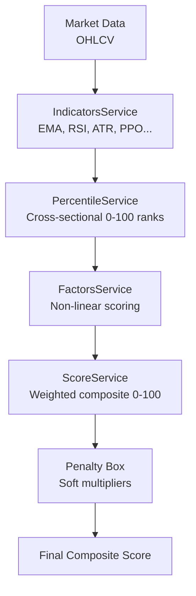
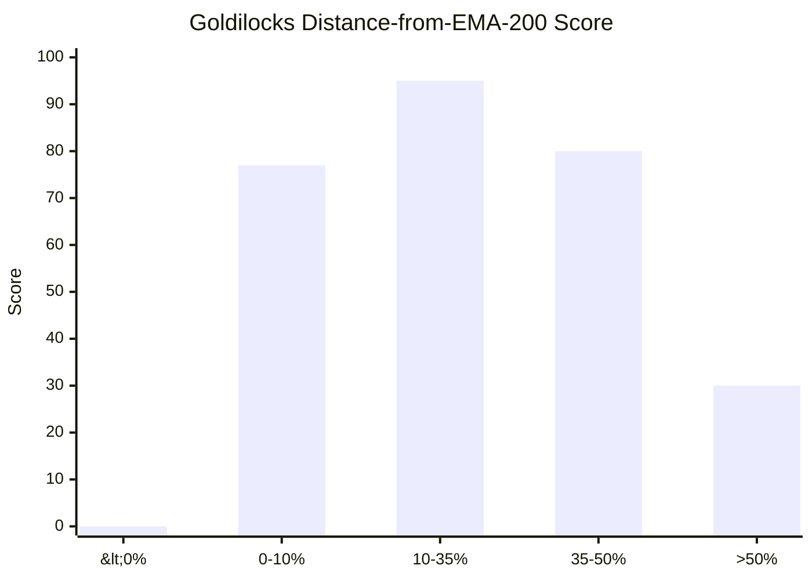
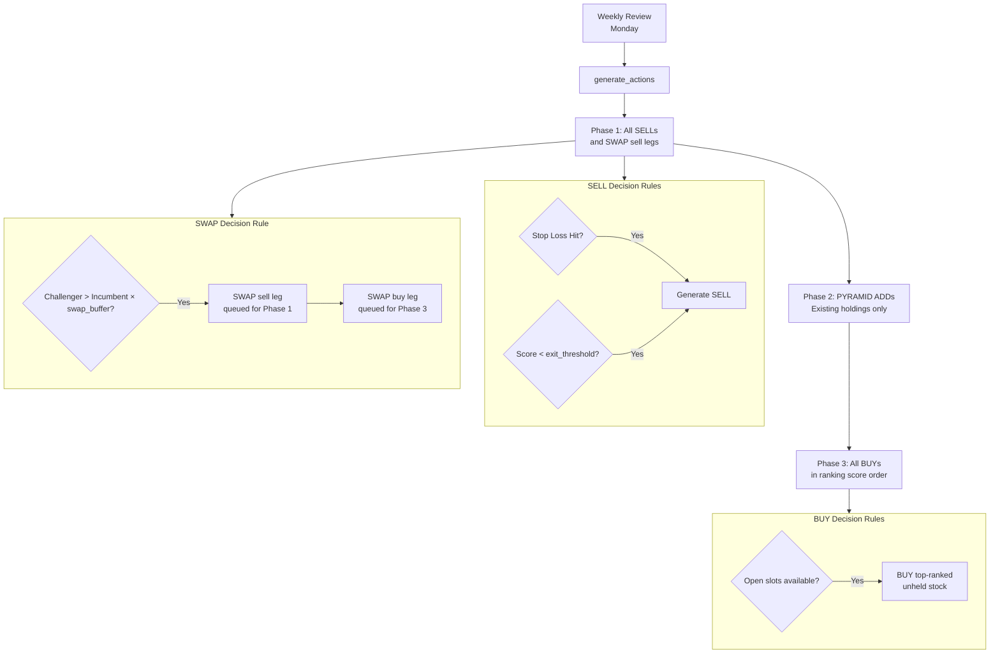

# Strategy Guide

> **Last Updated:** 2026-05-03

Comprehensive guide to the momentum-based multi-factor scoring system, trading logic, and risk controls.

---

## 🧠 Strategy Philosophy

The core philosophy is **"Goldilocks Momentum"**:

1. **Trend**: Buy stocks in a steady uptrend (not too steep, not too flat).
2. **Momentum**: Buy when RSI is in the "sweet spot" (50-70), avoiding overbought extremes (>85).
3. **Efficiency**: Prefer smooth curves (low volatility) over jagged spikes.
4. **Volume/Conviction**: Ensure price moves are supported by volume conviction.
5. **Structure**: Use Bollinger Band structure to time entries.

The system does not predict the future — it selects stocks that are already in strong, healthy trends and manages risk through systematic stop-losses and weekly rebalancing.

---

## 📊 Factor Scoring Model

The composite score (0-100) is a weighted sum of 5 factors. Each factor is computed by `FactorsService` and normalized to a 0–100 range before weighting.


```mermaid
flowchart TD
    MD[Market Data\nOHLCV] --> IND[IndicatorsService\nEMA, RSI, ATR, PPO...]
    IND --> PCT[PercentileService\nCross-sectional 0-100 ranks]
    PCT --> FS[FactorsService\nNon-linear scoring]
    FS --> CS[ScoreService\nWeighted composite 0-100]
    CS --> PB[Penalty Box\nSoft multipliers]
    PB --> FINAL[Final Composite Score]
```

**Top-level weights** (must sum to 1.0, enforced at startup via `StrategyParameters.__post_init__`):

| Factor | Config Key | Default Weight | Components |
|--------|-----------|---------------|------------|
| **Trend** | `trend_strength_weight` | **30%** | EMA-50 Slope (60%) + Distance from EMA-200 (40%) |
| **Momentum** | `momentum_velocity_weight` | **25%** | RSI (60%) + PPO (20%) + PPO Hist (10%) + Pure Momentum (10%) |
| **Risk Efficiency** | `risk_efficiency_weight` | **20%** | ROC / ATR Ratio |
| **Conviction** (Volume) | `conviction_weight` | **15%** | Relative Volume (70%) + Price-Vol Correlation (30%) |
| **Structure** | `structure_weight` | **10%** | %B Bollinger (50%) + Bollinger Width (50%) |

> **Note:** The 4th factor is named `conviction_weight` in code (`strategies_config.py`), not `volume_weight`, even though it is backed by volume metrics.

---

### 1. Trend Factor — Goldilocks Scoring

Distance from the 200-day EMA is scored non-linearly. A stock that is too far above its EMA is overextended and penalized; one too close has not confirmed its uptrend.


```mermaid
xychart-beta
    title "Goldilocks Distance-from-EMA-200 Score"
    x-axis ["<0%", "0-10%", "10-35%", "35-50%", ">50%"]
    y-axis "Score" 0 --> 100
    bar [0, 77, 95, 80, 30]
```

| Distance from EMA-200 | Score Zone | Logic |
|-----------------------|------------|-------|
| < 0% | 0 | **Bearish** — below 200 EMA |
| 0% – 10% | 70 → 85 | **Early Trend** — building up |
| **10% – 35%** | **85 → 100** | **Sweet Spot (Goldilocks)** |
| 35% – 50% | 100 → 60 | **Extended** — risk of mean reversion |
| > 50% | 60 → 0 | **Over-Extended** — bubble territory |

The EMA-50 slope is normalized to [-5, +5] range and mapped linearly to 0–100, then combined with the distance score using `trend_slope_weight = 0.60` and `trend_distance_200_weight = 0.40`.

---

### 2. Momentum Factor — RSI Regime

RSI is scored non-linearly to favor stocks in sustainable uptrends rather than overbought or recovering situations.

| RSI (14, smoothed) | Score Zone | Logic |
|--------------------|------------|-------|
| < 40 | 0 | **Bearish** |
| 40 – 50 | 0 → 30 | **Recovery** |
| **50 – 70** | **30 → 100** | **Bullish Sweet Spot** |
| 70 – 85 | 100 → 90 | **Strong** (watch for exhaustion) |
| > 85 | 90 → 60 | **Overbought** (capped at 60 floor) |

PPO (12/26/9), PPO Histogram, and pure skip-week momentum (average of 3-month and 6-month ROC, skipping last 5 days) are added with their respective sub-weights.

---

## 🚫 Penalty Box Rules

The penalty box applies **multiplicative score adjustments** — it does **not** hard-zero all penalized stocks. Only penny stocks and illiquid stocks receive a true hard exclusion.

| Condition | Penalty Multiplier | Type |
|-----------|-------------------|------|
| Price < EMA-200 (major trend down) | × 0.5 | Soft |
| Price < EMA-50 (medium trend down) | × 0.7 | Soft |
| ATR Spike > 2× lagged ATR average | × 0.8 | Soft |
| EMA-50 < `min_price` (₹50 default) | × 0.0 | **Hard exclusion** |
| Avg daily turnover < `min_turnover` (₹0.5Cr) | × 0.0 | **Hard exclusion** |

Multiple soft penalties stack multiplicatively. A stock below both EMA-200 and EMA-50 with an ATR spike receives `0.5 × 0.7 × 0.8 = 0.28` of its original score.

> Penalties are implemented in `ScoreService._apply_soft_penalties()`. Hard exclusions (penny stock, low liquidity) override soft multipliers and set `penalty = 0.0`.

---

## 🔄 Trading Logic — Three-Phase Action Generation

Each Monday, the system generates actions in a strict three-phase sequence. All SELLs are processed before any BUYs so that capital from exits is available for new entries.


```mermaid
flowchart TD
    Start[Weekly Review\nMonday] --> GenActions[generate_actions]

    GenActions --> P1[Phase 1: All SELLs\nand SWAP sell legs]
    P1 --> P2[Phase 2: PYRAMID ADDs\nExisting holdings only]
    P2 --> P3[Phase 3: All BUYs\nin ranking score order]

    subgraph SellLogic [SELL Decision Rules]
        SL_Hit{Stop Loss Hit?} -- Yes --> SELL[Generate SELL]
        Score_Low{Score < exit_threshold?} -- Yes --> SELL
    end

    subgraph SwapLogic [SWAP Decision Rule]
        Better{Challenger > Incumbent × swap_buffer?} -- Yes --> SWAP_SELL[SWAP sell leg\nqueued for Phase 1]
        SWAP_SELL --> SWAP_BUY[SWAP buy leg\nqueued for Phase 3]
    end

    subgraph BuyLogic [BUY Decision Rules]
        Vacancy{Open slots available?} -- Yes --> BUY[BUY top-ranked\nunheld stock]
    end

    P1 --> SellLogic
    P1 --> SwapLogic
    P3 --> BuyLogic
```

### Phase 1: SELL

Close positions if any of these conditions are met:

- **Stop-Loss Hit**: Current price or weekly low has breached the trailing stop-loss.
- **Score Degradation**: Composite score drops below `exit_threshold` (default: **40**).

### Phase 2: PYRAMID ADD (optional)

If pyramiding is enabled (`enable_pyramiding=True`), the engine can add to an existing winning position. The additional units are sized as a fraction (`pyramid_fraction`) of total capital. The existing stop-loss is preserved — it does not reset.

### Phase 3: BUY

Fill open portfolio slots (up to `max_positions`) with the highest-ranked stocks from the current week's ranking list that are not already held. Swap buy legs are interleaved with regular buys in ranking order so the highest-scoring stock always gets priority.

**Backfill**: After planned buys are placed, any remaining open slots are filled from the same ranked list as a "vacancy backfill."

---

### SWAP Logic: Champion vs Challenger

An existing holding ("Incumbent") is replaced by a new candidate ("Challenger") only if:

```
Challenger Score > Incumbent Score × swap_buffer
```

Where `swap_buffer = 1 + config.buffer_percent`. With the default `buffer_percent = 0.25`, a challenger must score **25% higher** than the incumbent to trigger a swap.

> ⚠️ The docs previously stated this buffer was 10%. The correct default is **25%** (`buffer_percent = 0.25`). Adjust in `src/config/strategies_config.py` or via the `/api/v1/config/` endpoint.

---

## 🛑 Stop-Loss System

The system uses a **Hybrid Stop-Loss** combining an ATR-based trailing stop with an intraday hard stop.

### ATR Trailing Stop

- **Initial SL** = Entry Price − (ATR × `sl_multiplier`)
- The stop is trailed **up only** — it never moves down.
- Each Monday, `update_holding()` calls `calculate_effective_stop()` which returns `max(new_atr_stop, previous_stop)`.

### Intraday Hard Stop (Backtesting Mode)

In daily SL mode (`check_daily_sl=True`), the backtest engine also checks:
- If today's **Low ≤ current SL × 0.95** → execute immediately at the hard SL price (intraday exit).
- If today's **Close < current SL** (Mon–Thu only) → queue a sell at next day's open.

---

## ⚖️ Position Sizing

Position size is determined by risk management first, then constrained by available capital and portfolio concentration limits.

**Formula:**
```
Shares = (Total Capital × risk_per_trade) / (ATR × sl_multiplier)
```

**Constraints (most restrictive wins):**

| Constraint | Default | Description |
|-----------|---------|-------------|
| `risk_per_trade` | 1.0% | Max portfolio risk per single position |
| Minimum position value | Configurable | Rejects tiny positions below a threshold |
| Capital check | `remaining_capital` | Position value must not exceed available cash |

---

## 🛡️ Portfolio Controls

Portfolio-level risk controls are defined in `PortfolioControlConfig` (configured in `strategies_config.py`):

| Metric | Condition | Action |
|--------|-----------|--------|
| **Drawdown** | > 15% | Pause new entries — hold cash |
| **Drawdown** | > 20% | Reduce exposure — scale down positions by 30% |
| **Sector Exposure** | > 40% | Block new buys in that sector |
| **Correlation** | > 0.70 | Alert if >3 stocks are highly correlated |

> **Note:** Portfolio controls are defined in the config but some enforcement mechanisms (e.g., sector limits, correlation checks) are specified as pending implementation in `docs/pending_items.md`.

---

## 🇮🇳 Transaction Costs & Tax

The system models realistic Indian market costs to give accurate backtest results.

### Transaction Costs

| Fee | Rate | Notes |
|-----|------|-------|
| STT | 0.1% | On buy & sell (delivery) |
| Exchange Txn | 0.00345% | NSE/BSE charges |
| SEBI Turnover | ₹10/Crore | Regulatory fee |
| Stamp Duty | 0.015% | Buy side only |
| GST | 18% | On brokerage + exchange + SEBI |
| DP Charges | ₹13 + GST | Per sell (depository participant) |

### Tax Optimization

| Tax | Rate | Condition |
|-----|------|-----------|
| STCG | 20% | Holding < 1 year |
| LTCG | 12.5% | Holding ≥ 1 year |
| LTCG Exemption | ₹1.25 lakh / year | First ₹1.25L LTCG is tax-free |

The `hold_for_ltcg` API endpoint estimates whether holding a position until the 1-year mark saves enough in taxes to outweigh the opportunity cost. This is an advisory output — it does not automatically modify stop-loss levels.

---

## 🔧 Configuration

All parameters are in `src/config/strategies_config.py` and can be updated at runtime via the `/api/v1/config/` endpoint.

| Parameter | Default | Description |
|-----------|---------|-------------|
| `trend_strength_weight` | 0.30 | Weight for Trend factor |
| `momentum_velocity_weight` | 0.25 | Weight for Momentum factor |
| `risk_efficiency_weight` | 0.20 | Weight for Risk Efficiency factor |
| `conviction_weight` | 0.15 | Weight for Conviction (Volume) factor |
| `structure_weight` | 0.10 | Weight for Structure factor |
| `atr_threshold` | 2.0 | ATR spike penalty threshold |
| `min_price` | 50.0 | Hard exclusion: EMA-50 below this price |
| `min_turnover` | 0.5 | Hard exclusion: avg turnover (₹Cr/day) below this |
| `sl_multiplier` | — | ATR multiplier for stop-loss distance |
| `exit_threshold` | 40 | Score below which a position is sold |
| `buffer_percent` | 0.25 | Swap buffer — challenger must beat incumbent by this fraction |
| `max_positions` | 15 | Maximum number of concurrent holdings |
