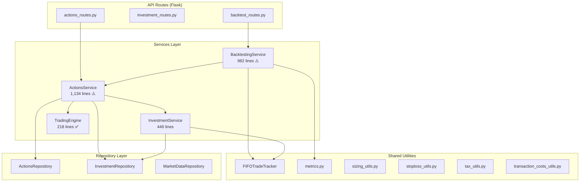
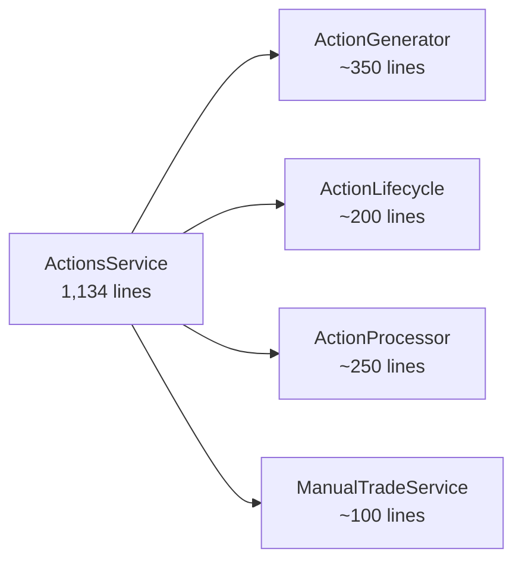

# Codebase Analysis: stocks_screener_v2

## Executive Summary

After scanning **~6,500 lines** across 25+ files, the codebase has **strong foundational architecture** (layered repo/service/route pattern, shared utilities, session injection for backtesting) but has accumulated significant complexity in three "god" files. Below are the findings organized into **Bugs**, **Complexity Hotspots**, and **Simplification Opportunities**.

---

## Current Architecture



---

## 🐛 Active Bugs

### Bug 1: `sell_action()` PnL uses `sell_units` instead of `total_matched`

**File:** [fifo_matcher.py](file:///c:/Users/harsh/Documents/GitHub/stocks_screener_v2/src/utils/fifo_matcher.py#L102)

```python
# Line 102
pnl = (sell_price - entry_price) * sell_units  # ← uses sell_units
```

When a sell can only be **partially matched** (pool exhausted), `total_matched < sell_units`. The PnL is then calculated on more units than were actually matched, inflating the reported PnL.

> [!WARNING]
> **Impact:** Overstated PnL on partial FIFO matches. This ripples into trade journal, backtest metrics, and XIRR calculations.

**Fix:** `pnl = (sell_price - entry_price) * total_matched`

---

### Bug 2: `_process_sell_actions()` computes PnL on full holding, not sold units

**File:** [actions_service.py](file:///c:/Users/harsh/Documents/GitHub/stocks_screener_v2/src/services/actions_service.py#L862-L864)

```python
# Lines 862-864
cost_basis_price = holding.avg_price
buy_value = cost_basis_price * holding.units    # ← uses holding.units
pnl = sell_value - buy_value                    # ← full position PnL
```

For a **partial sell** (e.g., swap selling only some units), `holding.units` is the *total* position, but only `action.units` are being sold. The `realized_gain` capital event is then **too large** (or too negative), corrupting `total_capital`.

**Fix:** `buy_value = cost_basis_price * action.units`

---

### Bug 3: `remaining_capital` mutation on zero-unit buys

**File:** [actions_service.py](file:///c:/Users/harsh/Documents/GitHub/stocks_screener_v2/src/services/actions_service.py#L140)

```python
# Line 140
remaining_capital -= action["capital"]  # capital=0 when units=0, so no-op here
```

This is benign for zero-unit buys (capital=0), but the function **mutates the caller's remaining_capital** regardless. If `buy_action()` is ever called with explicit units > 0 but the wrong `price`, the caller's budget silently drifts. The pattern of mutating a passed-in float and returning it is fragile.

> [!NOTE]
> Not a crash bug, but a **design smell** that has caused past bugs (conversation history shows multiple `remaining_capital` drift issues).

---

### Bug 4: `approve_all_actions()` sells — `remaining_capital` double-counts

**File:** [actions_service.py](file:///c:/Users/harsh/Documents/GitHub/stocks_screener_v2/src/services/actions_service.py#L744-L745)

```python
# Lines 744-745
sell_proceeds = float(item.units * execution_price)
remaining_capital += sell_proceeds
```

This adds the **full sell proceeds** to `remaining_capital`, but `remaining_capital` was initialized from `summary.remaining_capital` which already includes the cost basis as "cash". The net effect is that capital available for subsequent buys in the same batch is **inflated** by the cost basis of the sold position.

> [!WARNING]
> **Impact:** Overbought positions in the same approval batch when sells precede buys.

---

### Bug 5: `create_manual_buy()` looks up market data with `date - timedelta(days=1)`

**File:** [actions_service.py](file:///c:/Users/harsh/Documents/GitHub/stocks_screener_v2/src/services/actions_service.py#L1078-L1081)

```python
# Lines 1078-1081
prev_close = float(
    self.marketdata_repo.get_marketdata_by_trading_symbol(
        stock["symbol"], stock["date"] - timedelta(days=1)
    ).close
)
```

`stock["date"] - timedelta(days=1)` can land on a weekend or holiday, returning `None` → `AttributeError: 'NoneType' object has no attribute 'close'`. Should use `get_previous_business_day()`.

---

### Bug 6: `sync_prices()` returns `[]` instead of a string

**File:** [investment_service.py](file:///c:/Users/harsh/Documents/GitHub/stocks_screener_v2/src/services/investment_service.py#L420)

```python
# Line 420
if not holdings:
    return []   # ← return type says str, returns list
```

Callers expecting a string message will fail. Minor but inconsistent.

---

### Bug 7: `TradingEngine` — `remaining_holdings` not populated for held stocks *in* candidates

**File:** [trading_service.py](file:///c:/Users/harsh/Documents/GitHub/stocks_screener_v2/src/services/trading_service.py#L153-L156)

```python
# Lines 153-156
else:
    if h.symbol not in candidate_symbols:
        remaining_holdings.append(h)  # ← only non-candidate holdings
    surviving_holdings[h.symbol] = h
```

`remaining_holdings` is used later to find the **weakest** holding for swaps. But holdings that *are* in the candidate list are excluded, even though they could be the weakest. This means a stock with score 41 that's both held AND in candidates can never be swapped out, even if a new candidate with score 90 appears.

> [!IMPORTANT]
> **Impact:** Sub-optimal swap decisions — some weak holdings are swap-proof if they remain in the ranked list.

---

## 🏗️ Complexity Hotspots

### 1. `ActionsService` — 1,134 lines, 14 methods, 3 distinct responsibilities

| Responsibility | Methods | Lines |
|---|---|---|
| **Action generation** | `buy_action`, `sell_action`, `generate_actions`, `_load_market_context`, `_execute_sells`, `_execute_pyramid_adds`, `_execute_buys`, `_persist_actions`, `check_daily_stoploss` | ~500 |
| **Action lifecycle** | `approve_all_actions`, `reject_pending_actions` | ~140 |
| **Action processing** | `process_actions`, `_process_sell_actions`, `_process_buy_actions`, `_update_held_positions` | ~250 |
| **Manual trades** | `create_manual_buy`, `create_manual_sell` | ~70 |

This is a **god class**. The `approve_all_actions` method alone is 115 lines and handles sell approval, buy re-sizing, cost calculation, and tax computation.

---

### 2. `WeeklyBacktester` — 982 lines across 3 classes in one file

The file contains `WeeklyBacktester` + `BacktestingService` + `BacktestRiskMonitor`, which is reasonable, but:

- `_generate_report()` is **230 lines** of string formatting mixed with metric computation
- `_compute_costs_and_taxes()` duplicates FY-netting logic that should live in `tax_utils.py`
- `_process_daily_stoploss()` is 100 lines of intricate Phase 1/Phase 2 state management

---

### 3. `InvestmentService.get_summary()` — dual responsibility

[get_summary()](file:///c:/Users/harsh/Documents/GitHub/stocks_screener_v2/src/services/investment_service.py#L320-L409) computes the weekly portfolio summary, but:
- It queries `get_total_capital` **twice** (lines 338 and 368) with different params
- It has a `prev_summary` fallback chain for `starting_capital` that's fragile
- The `remaining_capital` computation is correct (first-principles) but is then *also* stored separately in the summary model, creating two sources of truth

---

## 🔧 Simplification Opportunities

### Priority 1: Split `ActionsService` into 3 focused classes



| New Class | Responsibility | Current Methods |
|---|---|---|
| `ActionGenerator` | Generate buy/sell/swap decisions | `buy_action`, `sell_action`, `generate_actions`, `check_daily_stoploss`, `_load_market_context`, `_execute_*`, `_persist_actions` |
| `ActionLifecycle` | Approve, reject, update status | `approve_all_actions`, `reject_pending_actions` |
| `ActionProcessor` | Execute approved actions → update holdings | `process_actions`, `_process_sell_actions`, `_process_buy_actions`, `_update_held_positions` |
| `ManualTradeService` | Manual buy/sell entry | `create_manual_buy`, `create_manual_sell` |

---

### Priority 2: Extract `_compute_costs_and_taxes()` to `tax_utils.py`

**Before:** Logic lives in `backtesting_service.py:331-423` (93 lines)

**After:** A shared `compute_fy_taxes(sell_trades, tax_config)` function in `tax_utils.py` that both `WeeklyBacktester.get_summary()` and `_generate_report()` call.

This eliminates the only remaining logic duplication between backtest and live paths.

---

### Priority 3: Extract `_generate_report()` to a standalone `ReportBuilder`

The 230-line report generator has **zero dependency** on `WeeklyBacktester` state beyond `self.risk_monitor`, `self.config`, and the date range. Extract it:

```python
class BacktestReportBuilder:
    def __init__(self, config, risk_monitor, start_date, end_date, ...):
        ...
    def build(self) -> str:
        ...
```

This makes it testable independently and removes ~230 lines from the already-large `backtesting_service.py`.

---

### Priority 4: Simplify `remaining_capital` tracking

Currently, `remaining_capital` is:
1. Computed from first principles in `InvestmentRepository.get_remaining_capital()`
2. Stored in `InvestmentsSummaryModel.remaining_capital`
3. Threaded through `buy_action()` / `sell_action()` as a mutable parameter
4. Re-derived in `InvestmentService.get_summary()` and `get_portfolio_summary()`

**Recommendation:** Always derive from first principles (`total_capital - cost_basis`). Remove the stored column and the pass-through parameter pattern. This eliminates the entire class of "remaining_capital drift" bugs that appear repeatedly in conversation history.

---

### Priority 5: Eliminate `Dict` return types — use dataclasses

Many methods return `Dict` (actions, holdings, summaries). These are:
- Not self-documenting (what keys exist?)
- Easy to misspell keys
- Hard to refactor

**Before:**
```python
action = {
    "action_date": action_date,
    "type": "buy",
    "reason": reason,
    "symbol": symbol,
    ...
}
```

**After:**
```python
@dataclass
class TradeAction:
    action_date: date
    type: str  # or an Enum
    reason: str
    symbol: str
    units: int
    ...
```

---

### Priority 6: Consolidate `HoldingSnapshot` construction

`HoldingSnapshot` is created in **4 different places** with slightly different field mappings:

| Location | File | Lines |
|---|---|---|
| `_load_market_context` | actions_service.py | 329-338 |
| `_process_sell_actions` (from holding) | actions_service.py | 837-844 |
| `_process_sell_actions` (from buy_action) | actions_service.py | 826-833 |
| Phase 1 sell check | trading_service.py | 129-156 |

Add a `HoldingSnapshot.from_holding(h)` classmethod and a `HoldingSnapshot.from_action(a)` classmethod.

---

### Priority 7: Reduce `approve_all_actions()` complexity

The method is 115 lines with two for-loops, nested conditions, and three different calculation paths. Split into:

```python
def approve_all_actions(self, action_date):
    remaining = self._init_capital(action_date)
    remaining = self._approve_sells(actions_list, action_date, remaining)
    remaining = self._approve_buys(actions_list, action_date, remaining)
    return count
```

---

## 📊 Complexity Metrics Summary

| File | Lines | Methods | Cyclomatic Complexity | Verdict |
|---|---|---|---|---|
| `actions_service.py` | 1,134 | 14 | Very High | **Split into 3-4 classes** |
| `backtesting_service.py` | 982 | 12 | High | **Extract report + tax logic** |
| `investment_service.py` | 446 | 9 | Medium | **Simplify `get_summary()`** |
| `trading_service.py` | 218 | 1 | Low | ✅ Clean |
| `fifo_matcher.py` | 178 | 4 | Low | ✅ Clean (fix Bug 1) |
| `metrics.py` | 352 | 9 | Low | ✅ Clean |
| `init_service.py` | 615 | 8 | Medium | OK (data pipeline) |
| `sizing_utils.py` | 81 | 1 | Low | ✅ Clean |
| `stoploss_utils.py` | 67 | 2 | Low | ✅ Clean |
| `tax_utils.py` | 147 | 3 | Low | ✅ Clean |
| `transaction_costs_utils.py` | 144 | 5 | Low | ✅ Clean |

---

## 🗺️ Recommended Refactoring Order

> [!TIP]
> Fix bugs first, then refactor. Each step is independently shippable.

1. **Fix Bug 1** (FIFO PnL) — 1-line fix, high impact
2. **Fix Bug 2** (partial sell PnL) — 1-line fix, high impact  
3. **Fix Bug 5** (manual buy date) — use `get_previous_business_day()`
4. **Fix Bug 7** (swap logic) — decide if held+ranked stocks should be swappable
5. **Extract `_compute_costs_and_taxes()`** to `tax_utils.py` — eliminates duplication
6. **Split `ActionsService`** into Generator / Lifecycle / Processor
7. **Extract `BacktestReportBuilder`** — standalone, testable
8. **Introduce action/holding dataclasses** — replaces Dict returns
9. **Simplify `remaining_capital`** — single source of truth

---

## Open Questions

> [!IMPORTANT]
> **Q1:** For Bug 7 (swap logic) — should a held stock that's still ranked but with a low score be eligible for swap-out? The current code protects it, which may be intentional ("don't swap a ranked stock").

> [!IMPORTANT]
> **Q2:** For Bug 4 (approve double-count) — the `remaining_capital` initialization from `summary.remaining_capital` assumes the summary is up-to-date. During a batch approval, should remaining_capital be re-derived from first principles instead?

> [!IMPORTANT]
> **Q3:** How aggressive should the refactor be? Options:
> - **A)** Fix bugs only (1-2 days)
> - **B)** Fix bugs + extract duplicated logic (3-4 days)
> - **C)** Full restructure including class splits and dataclasses (1-2 weeks)
